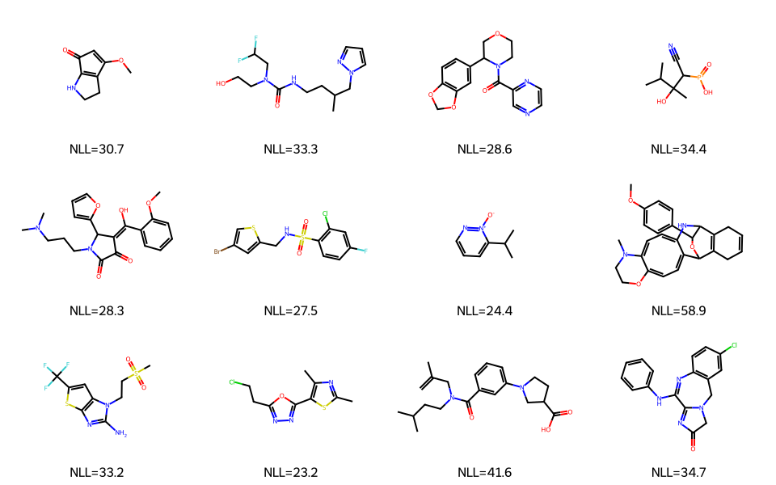

# REINVENT4 Tutorial 01: Installation & First Molecule

!!! abstract "Chapter 1 of the REINVENT4 course"
    In this chapter you install REINVENT4 from scratch and generate your first
    set of AI-designed molecules — a real `sampled.csv` file you can open,
    validate, and draw. Everything here was run on a plain **CPU** (no GPU
    required) and is fully reproducible.

## Learning Objectives

After completing this chapter, you will be able to:

- [ ] Explain what REINVENT4 is and the design tasks it solves.
- [ ] Install REINVENT4 in a clean environment and understand *why* each version choice matters.
- [ ] Distinguish between a **prior**, an **agent**, and a **vocabulary**.
- [ ] Run a `sampling` job and produce a real `sampled.csv`.
- [ ] Read the output columns (`SMILES`, `SMILES_state`, `NLL`) and explain duplicates, invalid molecules, and why there is *no* `Score` column yet.

## Why It Matters

REINVENT4 is one of the most mature reinforcement-learning frameworks for
molecular generation. It keeps molecules chemically reasonable while
continuously optimizing candidate properties against a **user-defined reward
function**.

Typical applications:

- **Lead Optimization** — improve potency/ADMET of an existing hit.
- **Scaffold Hopping** — find new cores with similar activity.
- **Multi-Parameter Optimization (MPO)** — balance many objectives at once.
- **Docking-guided Design** — steer generation with docking scores.

!!! tip "What you'll have by the end of this chapter"
    A file called `sampled.csv` produced by the model itself. Each row is a
    generated molecule with:

    | Column | Meaning |
    |--------|---------|
    | `SMILES` | the generated molecule |
    | `SMILES_state` | validity flag (`1` = valid) |
    | `NLL` | negative log-likelihood — how "confident" the model is |

    Here are 12 molecules from the real run in this chapter:

    

## Hands-on Practice

### Prerequisites

- **OS:** Linux (Ubuntu 22.04/24.04). macOS and Windows work too, Linux is best validated.
- **Python:** 3.11 or newer (see the version note below).
- **GPU:** *Not required for this chapter.* Sampling runs on CPU in seconds.
- **Disk/RAM:** ~2–3 GB free disk for dependencies; peak RAM for this run was **~550 MiB**.
- **Tools:** `git`, and either `conda` or Python's built-in `venv`.

#### Why these versions? (read before installing)

Beginners copy commands; engineers understand them. Here is the reasoning
behind every choice in this chapter.

=== "Why Python 3.11+?"

    REINVENT4 requires **Python ≥ 3.11**. You will still see older guides (and
    even some config comments) using `python=3.10` — that is out of date for
    current REINVENT4. Newer PyTorch wheels are built and tested against 3.11+,
    and REINVENT4's own `pyproject.toml` pins this floor. Using 3.10 leads to
    dependency-resolution failures during install.

=== "Why care about CUDA?"

    A GPU is optional. REINVENT4 automatically falls back to CPU when no GPU is
    present. **You only need CUDA for later chapters** (transfer learning and
    RL training), and even then the CUDA *toolkit* version must match your
    NVIDIA *driver*. For pure sampling (this chapter) `device = "cpu"` is
    perfectly fine.

=== "Why conda (or venv)?"

    Cheminformatics stacks mix compiled libraries (RDKit, PyTorch). An isolated
    environment prevents these from clashing with your system Python. `conda`
    is popular because it also manages non-Python binaries; a plain `venv`
    works equally well for CPU-only installs like this one.

=== "Why not just `pip install reinvent`?"

    REINVENT4 is **not** distributed as a simple PyPI package you install by
    name. You clone the repository and run its `install.py`, which selects the
    correct PyTorch build (CPU vs a specific CUDA/ROCm) for your hardware.
    Picking the wrong PyTorch wheel is the #1 cause of broken installs, so the
    project automates it.

### Step 1: Create an isolated environment

=== "conda"

    ```bash
    conda create -n reinvent4 python=3.11
    conda activate reinvent4
    ```

=== "venv (CPU-only)"

    ```bash
    python3 -m venv reinvent4-env
    source reinvent4-env/bin/activate
    ```

**Why this step?** Everything REINVENT4 pulls in (PyTorch, RDKit, pandas) lands
inside this environment, so you can delete the whole folder later without
touching your system.

### Step 2: Clone the repository

```bash
git clone --depth 1 https://github.com/MolecularAI/REINVENT4.git
cd REINVENT4
```

**Why this step?** `--depth 1` grabs only the latest snapshot — the full history
is large. You install *from inside* the repo because `install.py` and the
example configs live here.

### Step 3: Install REINVENT4 (CPU build)

```bash
python install.py cpu
```

**Why this step?** The positional argument is the **PyTorch processor type**.
Valid values include `cpu`, a CUDA tag like `cu126`, `rocm6.4`, `xpu`, or `mac`.
Passing `cpu` tells the installer to fetch CPU-only PyTorch wheels from
`https://download.pytorch.org/whl/cpu`.

!!! warning "If you use a slim dependency set"
    `install.py` installs the `all` optional dependencies by default. If you
    trim them (`python install.py cpu -d none`) you may hit
    `ModuleNotFoundError: No module named 'scipy'` on first run, because some
    reporting code imports SciPy unconditionally. Fix: `pip install scipy`.
    See [Common Errors](#common-errors).

Verify the CLI is on your PATH:

```bash
reinvent --version
```

```text
REINVENT 4.8.24 (C) AstraZeneca 2017, 2023 using PyTorch 2.12.0+cpu.
```

### Step 4: Download a prior model

REINVENT4 no longer ships the model weights inside the Git repo — the public
priors live on **Zenodo**
([DOI 10.5281/zenodo.15641296](https://doi.org/10.5281/zenodo.15641296)). For
de novo generation download the Reinvent prior and place it under `priors/`:

```bash
mkdir -p priors
curl -L -o priors/reinvent_pubchem.prior \
  "https://zenodo.org/api/records/20701824/files/reinvent_pubchem.prior/content"
```

!!! info "Prior vs Agent vs Vocabulary — the three words every tutorial skips"
    These three concepts confuse almost every newcomer, so let's be precise.

    - **Prior** — a *pre-trained* generative model that has learned the "grammar"
      of drug-like chemistry from a large database (this one from PubChem,
      2024-06-03). It knows how to write valid, realistic SMILES but has **no
      objective yet**. This is what you sample from in this chapter.
    - **Agent** — a *copy of the prior* that you later fine-tune with
      reinforcement learning so it drifts toward molecules that score well on
      your reward function. Prior and agent start identical; the agent changes,
      the prior stays fixed as a "reference" (used in later chapters).
    - **Vocabulary** — the set of tokens (atoms, bonds, ring markers) the model
      uses to build SMILES one step at a time. It is stored *inside* the prior
      file, which is why you don't pass it separately for the standard priors.

    In short: **the prior is the trained brain, the agent is the trainable copy,
    the vocabulary is the alphabet.**

### Step 5: Write your first config

REINVENT4 is driven by a [TOML](https://toml.io/) config. Create
`sampling.toml`:

```toml
run_type = "sampling"
device = "cpu"

[parameters]
model_file = "priors/reinvent_pubchem.prior"
output_file = "sampled.csv"
num_smiles = 100
unique_molecules = true
randomize_smiles = true
```

### Step 6: Generate your first molecules

```bash
reinvent -l sampling.log -s 42 sampling.toml
```

- `-l sampling.log` writes logs to a file (drop it to log to the screen).
- `-s 42` fixes the random seed so your run is reproducible.

On a 4-core CPU this finishes in about **3–4 seconds**. You now have a
`sampled.csv`. 🎉

### Common Errors

These are the highest-search-volume failures. Fixes are one line each.

??? failure "`ModuleNotFoundError: No module named 'scipy'`"
    Happens when optional dependencies were skipped. Install it:
    `pip install scipy`.

??? failure "`RuntimeError: CUDA out of memory` / CUDA errors"
    You asked for a GPU you don't have (or that's too small). For sampling just
    set `device = "cpu"` in the TOML, or override at runtime with `-d cpu`.

??? failure "`ImportError` / `ModuleNotFoundError` for RDKit"
    RDKit wasn't installed into the *active* environment. Confirm you activated
    the right env, then reinstall via `install.py` or `pip install rdkit`.

??? failure "`FileNotFoundError` — prior / checkpoint not found"
    `model_file` points to a path that doesn't exist. Check the exact filename
    under `priors/` (see Step 4) and use an absolute path if unsure.

??? failure "Vocabulary missing / token errors"
    For the standard priors the vocabulary is bundled inside the `.prior` file.
    This error usually means the prior file is corrupted or was only partially
    downloaded — re-download it from Zenodo.

## Code Walkthrough

Every parameter in `sampling.toml`, explained:

| Parameter | Value | Meaning |
|-----------|-------|---------|
| `run_type` | `"sampling"` | Run mode. `sampling` = generate from a fixed model (no training). |
| `device` | `"cpu"` | PyTorch device. Use `"cuda:0"` if you have a GPU; `"cpu"` otherwise. |
| `model_file` | `priors/...prior` | The prior (or a trained checkpoint) to sample from. Required. |
| `output_file` | `sampled.csv` | Where generated SMILES are written. |
| `num_smiles` | `100` | How many molecules to attempt. Final count can be lower (see below). |
| `unique_molecules` | `true` | Drop duplicate canonicalized SMILES from the output. |
| `randomize_smiles` | `true` | Randomize atom order of inputs to diversify sampling. |

!!! note "`num_smiles` is a request, not a guarantee"
    With `unique_molecules = true`, duplicates are removed *after* generation, so
    the file usually has fewer than `num_smiles` rows. Invalid molecules are
    dropped too. In this run, 100 requested → 4 invalid removed → **96 unique
    valid molecules** written.

## Expected Output

`sampled.csv` has three columns. Here are the first rows from the real run
([download the sample](../../assets/reinvent4/01/sampled-sample.csv)):

```text
SMILES,SMILES_state,NLL
COC1=CC(=O)C2=C1CCN2,1,30.71
CC(CCNC(=O)N(CCO)CC(F)F)Cn1cccn1,1,33.3
O=C(c1cnccn1)N1CCOCC1c1ccc2c(c1)OCO2,1,28.58
CC(C)C(C)(O)C(C#N)[P+](=O)O,1,34.42
COc1ccccc1C(O)=C1C(=O)C(=O)N(CCCN(C)C)C1c1ccco1,1,28.26
O=S(=O)(NCc1cc(Br)cs1)c1ccc(F)cc1Cl,1,27.52
CC(C)c1cccn[n+]1[O-],1,24.41
```

Summary statistics from this run:

| Metric | Value |
|--------|-------|
| Requested (`num_smiles`) | 100 |
| Invalid removed | 4 |
| Unique valid written | 96 |
| `NLL` min / mean / max | 21.37 / 36.44 / 76.98 |
| Wall-clock time (4-core CPU) | ~3.5 s |
| Peak memory | ~550 MiB |

The model logs also reveal its architecture — a 3-layer LSTM with ~5.9M
parameters:

```text
Number of network parameters: 5,880,195
RNN(
  (_embedding): Embedding(131, 256)
  (_rnn): LSTM(256, 512, num_layers=3, batch_first=True)
  (_linear): Linear(in_features=512, out_features=131, bias=True)
)
```

## Think About It

The parts other tutorials skip — these are exactly what you'll Google later.

1. **Why do some SMILES repeat (before dedup)?** Sampling is probabilistic;
   high-probability molecules get drawn more than once. `unique_molecules = true`
   removes them, which is why 100 requested became 96.
2. **Why are some molecules invalid?** The model emits SMILES token-by-token and
   can occasionally produce strings that RDKit can't sanitize (bad valences,
   impossible rings). REINVENT4 logs `failed to sanitize` and drops them —
   4 were removed in this run.
3. **Why is `NLL` different for each molecule?** `NLL` (negative log-likelihood)
   measures how probable the molecule was under the model. **Lower = the model
   was more confident.** Common, "typical" molecules have low NLL; unusual ones
   have high NLL (note the outlier at 76.98).
4. **Why is there no `Score` column (and why "Score = 0")?** Because this is a
   *sampling* run — there is no reward function attached, so nothing is scored.
   `Score` only appears in `scoring`/`staged_learning` runs. If you ever see a
   `Score` column full of zeros, it means a scoring component returned 0 (e.g.
   misconfigured), not that sampling failed.

## Exercises

1. **Easy:** Re-run with `num_smiles = 500`. How many unique valid molecules do
   you get? What fraction were invalid?
2. **Medium:** Set `unique_molecules = false` and count exact duplicates. Which
   molecule appears most often, and what is its NLL?
3. **Challenge:** Load `sampled.csv` in RDKit, compute molecular weight and
   LogP for each molecule, and plot NLL vs. molecular weight. Do "confident"
   (low-NLL) molecules tend to be smaller?

## Further Reading

- [REINVENT4 repository](https://github.com/MolecularAI/REINVENT4) — source, configs, and `configs/PARAMS.md`.
- [Public prior models on Zenodo](https://doi.org/10.5281/zenodo.15641296).
- Loeffler et al., *REINVENT 4: Modern AI-driven generative molecule design*, **J. Cheminformatics** (2024). [Open Access](https://doi.org/10.1186/s13321-024-00812-5).
- Handbook: [REINVENT4 course overview](index.md).

---

**Next chapter:** [Tutorial 02 — Prior Model](02-prior-model.md), where we look
inside the prior and learn how the model was trained before we start scoring
molecules.
