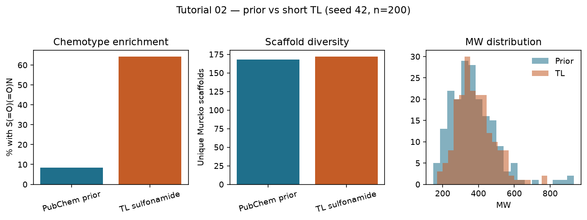
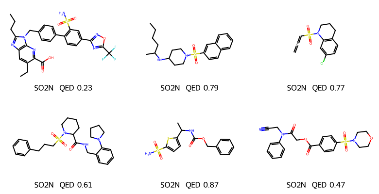
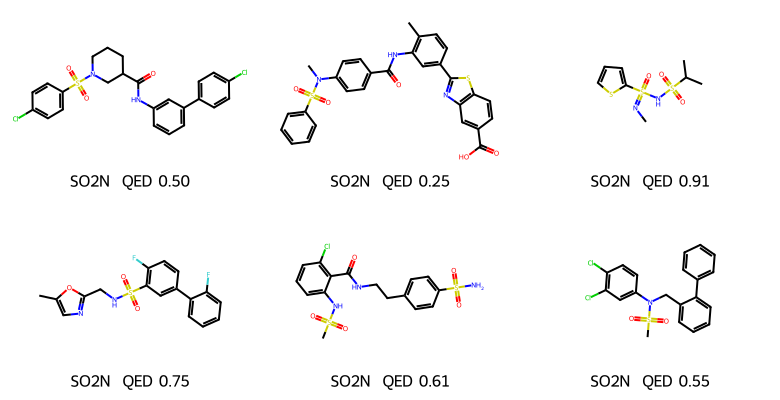

# REINVENT4 Tutorial 02: Priors in Practice

!!! abstract "Chapter 2 of the REINVENT4 course"
    Tutorial 01 gave you a prior file and a first `sampled.csv`. This chapter
    treats the prior as an **experimental choice**: you compare the public
    PubChem prior against a short **transfer-learning** checkpoint aimed at a
    project chemotype (sulfonamides), then decide with numbers — not vibes —
    whether the raw prior is good enough. Everything ran on **CPU**, seed
    **42**, and is fully reproducible.

## Learning Objectives

After completing this chapter, you will be able to:

- [ ] State what a prior actually encodes (chemical distribution), and why
      "download any `.prior`" is not a research decision.
- [ ] Run the **same sampling protocol** on two models (public prior vs TL
      checkpoint) with a fixed seed.
- [ ] Measure **chemotype hit rate**, Murcko scaffold diversity, and simple
      property distributions (MW, QED).
- [ ] Decide when to stay on the PubChem prior, when to TL, and when you need a
      different *generator* (LibInvent / LinkInvent / Mol2Mol) instead.
- [ ] Avoid the trap of judging a prior by architecture trivia that does not
      change the next experiment.

## Why It Matters

Official docs list prior filenames. Lab work asks a harder question:

> *Will this generative starting point cover the chemistry I care about?*

If your project is sulfonamide-rich (or macrocycles, peptides, covalent
warheads, …) and the prior almost never emits that motif, reinforcement
learning will spend its first hours rediscovering the motif — or never find it.
Transfer learning (deep dive in Tutorial 07) is the cheap way to **shift the
prior** toward a documented set before you burn RL steps.

This chapter runs a miniature of that decision:

| Model | Role |
|-------|------|
| `reinvent_pubchem.prior` | general drug-like de novo prior (Tutorial 01) |
| `tl_sulfonamide.model` | same architecture, fine-tuned 8 epochs on sulfonamides |

!!! tip "What you'll have by the end of this chapter"
    Two sampling CSVs from an identical protocol (`n ≈ 200`, seed 42, CPU) and
    a clear enrichment signal:

    | Metric | PubChem prior | After short TL |
    |--------|---------------|----------------|
    | Molecules with `S(=O)(=O)N` | **8.4%** | **64.3%** |
    | Unique Murcko scaffolds | 168 | 172 |
    | Mean QED | 0.59 | 0.65 |

    

## Hands-on Practice

### Prerequisites

- **Completed:** [Tutorial 01](01-installation-first-molecule.md) — REINVENT4
  installed and `priors/reinvent_pubchem.prior` on disk.
- **OS:** Linux (Ubuntu 22.04/24.04 validated).
- **Python / env:** the same `reinvent4` / `reinvent4-env` from Tutorial 01.
- **GPU:** *Not required.*
- **Disk/RAM:** TL peaked at **~871 MiB**; each sampling job is lighter.
- **Tools:** `reinvent` CLI; RDKit (already in the REINVENT4 env) for analysis.

```bash
reinvent --version
ls -lh priors/reinvent_pubchem.prior
```

```text
REINVENT 4.8.24 (C) AstraZeneca 2017, 2023 using PyTorch 2.12.0+cpu.
```

#### Why these design choices?

=== "Why prior vs TL, not two Zenodo filenames?"

    Many Zenodo files are **different generators** (Mol2Mol, LibInvent, …).
    Comparing `reinvent_pubchem.prior` to a Mol2Mol ECFP4 prior mixes tasks
    (free de novo vs seed-conditioned). A fair A/B test keeps the generator
    fixed and changes only the **weights** — TL does exactly that.

=== "Why sulfonamides?"

    `S(=O)(=O)N` is easy to SMARTS-match, common in drugs, and rare enough in
    raw PubChem-prior samples (~8% here) that enrichment after TL is obvious.
    Replace it with *your* project SMARTS later.

=== "Why only 8 TL epochs?"

    Enough to move the distribution on CPU in seconds; not a production prior.
    Tutorial 07 covers longer TL, validation curves, and overfitting checks.

=== "Why not inspect LSTM layer sizes?"

    Architecture dumps are in the log (`Number of network parameters: …`).
    They do not tell you whether the model covers your chemotype. Distributions
    do.

### Step 1: Get the illustrative sulfonamide training set

We provide a small SMILES set mined from prior samples (sulfonamide SMARTS
`S(=O)(=O)N`), split into train/validation:

- [sulfonamide_tl_train.smi](../../assets/reinvent4/02/sulfonamide_tl_train.smi) — 145 molecules after REINVENT's SMILES filter
- [sulfonamide_tl_val.smi](../../assets/reinvent4/02/sulfonamide_tl_val.smi) — 10 hold-outs

Copy them next to your prior:

```bash
# from the handbook repo, or download the raw files from docs/assets/reinvent4/02/
cp path/to/sulfonamide_tl_train.smi .
cp path/to/sulfonamide_tl_val.smi .
wc -l sulfonamide_tl_*.smi
```

!!! info "How this set was built (reproducibility note)"
    Sulfonamides were extracted from two `sampling` jobs on
    `reinvent_pubchem.prior` (`num_smiles = 500` seed 42, and `1500` seed 7),
    deduplicated, then split. You can rebuild it the same way; using the
    shipped `.smi` files keeps this chapter's wall-clock short and aligned with
    the published figures.

### Step 2: Short transfer learning → project checkpoint

Create `tl_sulfonamide.toml`:

```toml
run_type = "transfer_learning"
device = "cpu"
json_out_config = "_tl.json"

[parameters]
num_epochs = 8
save_every_n_epochs = 8
batch_size = 32
num_refs = 0
sample_batch_size = 100
input_model_file = "priors/reinvent_pubchem.prior"
smiles_file = "sulfonamide_tl_train.smi"
output_model_file = "tl_sulfonamide.model"
validation_smiles_file = "sulfonamide_tl_val.smi"
shuffle_each_epoch = true
randomize_smiles = true
standardize_smiles = true
```

```bash
reinvent -l tl.log -s 42 tl_sulfonamide.toml
```

On CPU this finished in about **13 seconds** (~871 MiB peak). You should see
the Reinvent generator load, ~145 training SMILES accepted, and
`tl_sulfonamide.model` written (~23 MB).

!!! tip "`sample_batch_size` floor"
    REINVENT 4.8.24 requires `sample_batch_size ≥ 100` for TL. Smaller values
    fail Pydantic validation before training starts.

### Step 3: Identical sampling protocol on both models

`sample_prior.toml`:

```toml
run_type = "sampling"
device = "cpu"

[parameters]
model_file = "priors/reinvent_pubchem.prior"
output_file = "compare_prior.csv"
num_smiles = 200
unique_molecules = true
randomize_smiles = true
```

`sample_tl.toml` — **only** `model_file` / `output_file` change:

```toml
run_type = "sampling"
device = "cpu"

[parameters]
model_file = "tl_sulfonamide.model"
output_file = "compare_tl.csv"
num_smiles = 200
unique_molecules = true
randomize_smiles = true
```

```bash
reinvent -l sample_prior.log -s 42 sample_prior.toml
reinvent -l sample_tl.log -s 42 sample_tl.toml
```

With `unique_molecules = true` you typically get slightly fewer than 200 rows
(our run: **191** prior, **196** TL) — that is expected.

### Step 4: Score the decision with RDKit

```bash
python - <<'PY'
import csv
from rdkit import Chem
from rdkit.Chem import Descriptors, QED
from rdkit.Chem.Scaffolds import MurckoScaffold

smarts = Chem.MolFromSmarts("S(=O)(=O)N")

def summarize(path):
    rows = list(csv.DictReader(open(path)))
    n = sulfa = 0
    scaffolds = set()
    qeds, mws = [], []
    for r in rows:
        m = Chem.MolFromSmiles(r["SMILES"])
        if m is None:
            continue
        n += 1
        sulfa += m.HasSubstructMatch(smarts)
        scaffolds.add(MurckoScaffold.MurckoScaffoldSmiles(mol=m))
        qeds.append(QED.qed(m))
        mws.append(Descriptors.MolWt(m))
    print(path, f"n={n}", f"sulfa%={100*sulfa/n:.1f}",
          f"scaffolds={len(scaffolds)}", f"QED={sum(qeds)/n:.3f}",
          f"MW={sum(mws)/n:.1f}")

summarize("compare_prior.csv")
summarize("compare_tl.csv")
PY
```

### Common Errors

??? failure "`sample_batch_size` validation error on TL"
    Set `sample_batch_size = 100` (or higher). This is independent of
    `batch_size`.

??? failure "TL runs but chemotype % barely moves"
    Training set too small / too few epochs, or SMARTS does not match how
    RDKit reads your SMILES. Check `HasSubstructMatch` on the *training* file
    first.

??? failure "Comparing Reinvent prior to Mol2Mol / LibInvent 'priors'"
    Those files need seed SMILES (and solve different tasks). You are no longer
    doing a controlled weight comparison — see the decision table below.

??? failure "`invalid hash` warning on the prior"
    Informational in current REINVENT4 builds; training still proceeds. Do not
    treat it as a corrupt download unless the run fails to load weights.

## Code Walkthrough

| Parameter | Value | Meaning |
|-----------|-------|---------|
| `run_type` | `"transfer_learning"` | Fine-tune weights on a SMILES file. |
| `input_model_file` | PubChem prior | Starting distribution. |
| `smiles_file` | train `.smi` | Project chemotype examples (1st column). |
| `validation_smiles_file` | val `.smi` | Optional hold-out for loss monitoring. |
| `num_epochs` | `8` | Short demo; raise for real campaigns. |
| `num_refs` | `0` | Disable ref-molecule similarity tracking (fine for tiny sets / speed). |
| `output_model_file` | `.model` | Checkpoint you can pass to `sampling` / later RL as agent/prior. |
| Sampling `model_file` | prior **or** `.model` | Same protocol → fair comparison. |

## Expected Output

Seed-42 comparison (`num_smiles = 200`, `unique_molecules = true`, CPU):

| Metric | PubChem prior | TL sulfonamide |
|--------|---------------|----------------|
| Rows (after unique) | 191 | 196 |
| Validity | 100% | 100% |
| `%` with `S(=O)(=O)N` | **8.4%** | **64.3%** |
| Unique Murcko scaffolds | 168 | 172 |
| Mean MW | 370.7 | 382.5 |
| Mean QED | 0.591 | 0.647 |
| Mean NLL | 35.95 | 29.48 |
| TL wall-clock | — | ~13 s |
| TL peak RAM | — | ~871 MiB |

Sample rows:
[compare-prior-sample.csv](../../assets/reinvent4/02/compare-prior-sample.csv),
[compare-tl-sample.csv](../../assets/reinvent4/02/compare-tl-sample.csv).

Example molecules (preferential sulfonamide display for TL):





### Decision table — what to do next

| Observation | Practical move |
|-------------|----------------|
| Prior already hits your SMARTS at acceptable rate | Stay on PubChem prior; go to [Tutorial 03](03-scoring-function.md) |
| Prior rarely hits; TL enriches without killing scaffolds | Use TL checkpoint as the starting agent/prior for RL |
| You need *linkers* / *R-group* / *analogue-by-seed* | Wrong generator — LibInvent / LinkInvent / Mol2Mol (not more PubChem epochs) |
| Peptides / exotic elements | Check prior element/token support; Pepinvent or a custom prior (Tutorial 12 notes) |

## Think About It

1. **Why did scaffold count stay high while sulfonamide % jumped?** Short TL
   shifted token preferences toward `SO2N` without fully collapsing Murcko
   diversity in this seed-42 draw. Longer TL on a tiny set often *does* collapse
   — watch scaffolds in Tutorial 07.
2. **Is a higher QED after TL "better"?** Only if QED is your goal. Here it
   moved as a side effect. Always separate *target chemotype* from *secondary
   properties*.
3. **Could RL alone replace this TL?** Eventually, if the reward pays for
   sulfonamides. TL is usually cheaper for "be in the right neighbourhood
   first."
4. **Why keep `randomize_smiles = true` on both legs?** So the comparison is
   not confounded by different SMILES augmentation settings.

## Exercises

1. **Easy:** Change the analysis SMARTS to `c1nccnc1` (pyrimidine). Does the TL
   sulfonamide model *hurt* pyrimidine rate vs the PubChem prior?
2. **Medium:** Train 3 epochs vs 16 epochs (same data, seed 42). Plot sulfonamide
   % and unique scaffolds vs epochs. Where does diversity drop?
3. **Challenge:** Build a TL set for *your* project SMARTS from a single
   `num_smiles = 2000` prior sample. Document hit count; refuse to TL if
   `n < 20` and explain why.

## Further Reading

- [REINVENT4 `configs/transfer_learning.toml`](https://github.com/MolecularAI/REINVENT4/blob/main/configs/transfer_learning.toml) — official TL template.
- [Public priors on Zenodo](https://doi.org/10.5281/zenodo.15641296) — generator-specific files; match file ↔ task.
- Loeffler et al., *REINVENT 4*, **J. Cheminformatics** (2024). [Open Access](https://doi.org/10.1186/s13321-024-00812-5).
- Handbook: [Tutorial 01](01-installation-first-molecule.md), [Tutorial 07 — Transfer Learning](07-transfer-learning.md).

---

**Next chapter:** [Tutorial 03 — Scoring Function](03-scoring-function.md),
where you attach a reward you can trust before reinforcement learning.
