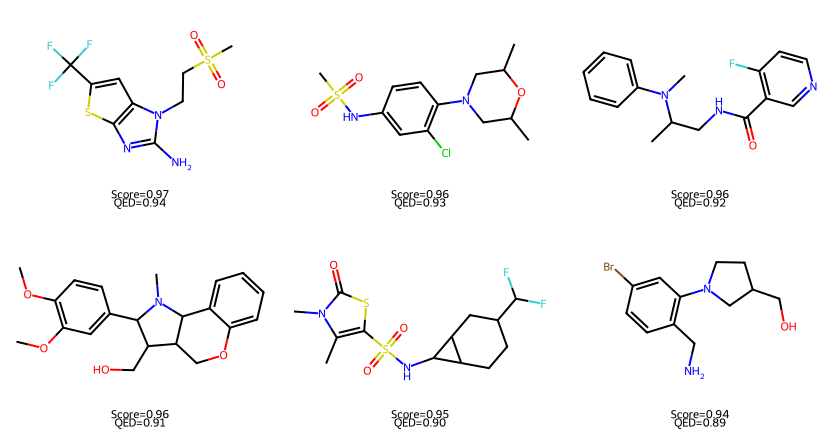
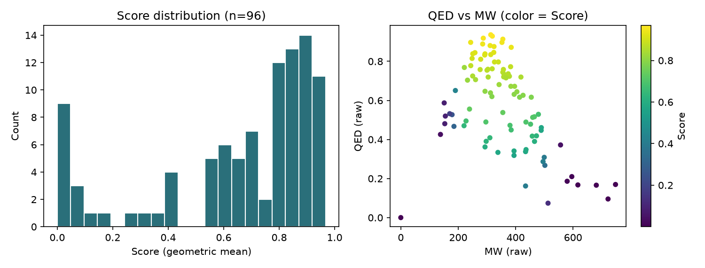

# REINVENT4 Tutorial 03: Scoring Function

!!! abstract "Chapter 3 of the REINVENT4 course"
    In this chapter you attach a **scoring function** to molecules — the reward
    signal that later chapters will use for reinforcement learning. You take the
    SMILES from [Tutorial 01](01-installation-first-molecule.md), define QED +
    molecular-weight objectives (plus a structural filter), and produce a real
    `scoring.csv` with a `Score` column. Everything here was run on a plain
    **CPU** and is fully reproducible.

## Learning Objectives

After completing this chapter, you will be able to:

- [ ] Explain why `run_type = "scoring"` exists separately from `sampling` and
      from reinforcement learning.
- [ ] Build a multi-parameter scoring function from **components**, **endpoints**,
      and **weights**.
- [ ] Choose a **transform** so raw property values (e.g. molecular weight ≈ 300)
      map into the \[0, 1\] range expected by aggregation.
- [ ] Contrast `geometric_mean` and `arithmetic_mean` aggregation.
- [ ] Use a **filter** component (`CustomAlerts`) and read why some molecules
      get a near-zero score even when other properties look fine.
- [ ] Interpret every column in `scoring.csv` (`Score`, transformed vs `(raw)`
      values, alert match patterns).

## Why It Matters

Sampling (Tutorial 01) only asks the prior: *"give me drug-like molecules."*
Drug discovery asks a harder question: *"which of these are worth making?"*

The scoring function is REINVENT4's answer. It turns chemistry objectives —
drug-likeness, size, similarity to a hit, docking score, QSAR predictions —
into a single number in \[0, 1\] that reinforcement learning can maximize.

Typical scoring building blocks:

- **Physicochemical filters** — MW, LogP, TPSA, H-bond counts (Lipinski-like).
- **Drug-likeness** — QED, synthetic accessibility (SAScore).
- **Similarity / substructure** — Tanimoto to a reference, SMARTS alerts.
- **External oracles** — docking, ChemProp models, REST endpoints (later chapters).

!!! tip "What you'll have by the end of this chapter"
    A file called `scoring.csv`. Each row is one input molecule with:

    | Column | Meaning |
    |--------|---------|
    | `Score` | aggregated reward (geometric mean here) |
    | `QED` / `MW` | transformed component scores in \[0, 1\] |
    | `QED (raw)` / `MW (raw)` | original property values before transform |
    | `Alerts` | filter flag (`1.0` = passed, `0.0` = matched a banned SMARTS) |

    Here are the six highest-scoring molecules from the real run:

    

## Hands-on Practice

### Prerequisites

- **Completed:** [Tutorial 01](01-installation-first-molecule.md) — REINVENT4
  installed and a `sampled.csv` available.
- **OS:** Linux (Ubuntu 22.04/24.04 validated).
- **Python / env:** the same `reinvent4` (conda) or `reinvent4-env` (venv) from
  Tutorial 01.
- **GPU:** *Not required.* Scoring with RDKit components is CPU-only.
- **Disk/RAM:** peak RAM for this run was **~614 MiB**.
- **Tools:** `reinvent` CLI on your `PATH`.

Verify the CLI:

```bash
reinvent --version
```

```text
REINVENT 4.8.24 (C) AstraZeneca 2017, 2023 using PyTorch 2.12.0+cpu.
```

!!! info "No prior model needed for scoring"
    `run_type = "scoring"` evaluates molecules you already have. It does **not**
    load a prior or train an agent. That is why this chapter can run without
    downloading weights again — only a SMILES file is required.

#### Why these design choices? (read before scoring)

=== "Why score before RL?"

    Reinforcement learning (Tutorial 04) will call your scoring function
    thousands of times. If the function is misconfigured — wrong SMARTS, missing
    transform, weight typo — RL wastes GPU hours optimizing garbage. Running
    `scoring` once on a fixed list is the cheapest way to debug the reward.

=== "Why transform molecular weight?"

    QED is already in \[0, 1\]. Molecular weight is ~150–700 Da. If you feed raw
    MW into a mean, a value of 300 *dominates* a QED of 0.8 and the aggregate is
    meaningless. Transforms squash each property into \[0, 1\] so weights have
    the meaning you intend.

=== "Why geometric mean?"

    Arithmetic mean lets one excellent component hide a failing one
    (`(1.0 + 0.0) / 2 = 0.5`). Geometric mean is harsh on zeros and low scores
    (`√(1.0 × 0.0) = 0`), which matches the intuition *"every objective must be
    at least acceptable."* REINVENT4 also accepts `arithmetic_mean` when you
    prefer compensation between objectives.

=== "Why CustomAlerts?"

    Some structural features are almost never wanted (huge rings, peroxides,
    charged carbons, …). Filters return 0 for matches and are applied
    **globally** — they do not participate in weight normalization. That is
    different from a soft penalty component.

### Step 1: Prepare a SMILES file from Tutorial 01

REINVENT4 scoring expects one SMILES per line (first column). Extract them from
your `sampled.csv`:

```bash
# run from the directory that contains sampled.csv (Tutorial 01)
python - <<'PY'
import csv
with open("sampled.csv") as f, open("compounds.smi", "w") as g:
    for row in csv.DictReader(f):
        g.write(row["SMILES"] + "\n")
print("wrote compounds.smi")
PY
```

In the reproducible run for this chapter we used the same seed-42 sampling job
as Tutorial 01: **96 unique valid molecules** → `compounds.smi`.

!!! tip "Quick check"
    `wc -l compounds.smi` should match the number of data rows in `sampled.csv`
    (header excluded). Each line must be a plain SMILES string — no CSV header.

### Step 2: Write `scoring.toml`

Create `scoring.toml` next to `compounds.smi`:

```toml
run_type = "scoring"
device = "cpu"
json_out_config = "_scoring.json"

[parameters]
smiles_file = "compounds.smi"
output_csv = "scoring.csv"

[scoring]
type = "geometric_mean"
parallel = 1

[[scoring.component]]
[scoring.component.custom_alerts]
[[scoring.component.custom_alerts.endpoint]]
name = "Alerts"
# filter: no weight — applied globally
params.smarts = [
  "[*;r{8-17}]",   # rings with 8–17 atoms
  "[#8][#8]",      # peroxide-like O–O
  "[#6;+]",        # charged carbon
  "[#16][#16]",    # S–S
  "C#C"            # terminal/internal alkyne (illustrative)
]

[[scoring.component]]
[scoring.component.QED]
[[scoring.component.QED.endpoint]]
name = "QED"
weight = 1.0

[[scoring.component]]
[scoring.component.MolecularWeight]
[[scoring.component.MolecularWeight.endpoint]]
name = "MW"
weight = 1.0
transform.type = "double_sigmoid"
transform.low = 200.0
transform.high = 500.0
transform.coef_div = 500.0
transform.coef_si = 20.0
transform.coef_se = 20.0
```

**Why this scoring function?**

| Piece | Role |
|-------|------|
| `QED` | already in \[0, 1\] — higher = more "drug-like" |
| `MolecularWeight` + `double_sigmoid` | prefer roughly 200–500 Da; scores decay outside that window |
| `custom_alerts` | hard reject a few unwanted SMARTS patterns |
| equal `weight = 1.0` | QED and MW contribute equally after transforms |

### Step 3: Run scoring

```bash
reinvent -l scoring.log -s 42 scoring.toml
```

- `-l scoring.log` writes logs to a file.
- `-s 42` fixes the seed (scoring itself is deterministic for these components,
  but keeping the flag matches the Tutorial 01 habit).

On a 4-core CPU this finished in about **2 seconds** of scoring work (~5 s
including process startup). You now have `scoring.csv`.

### Common Errors

??? failure "`FileNotFoundError` — smiles file not found"
    `smiles_file` is relative to your **current working directory**, not to the
    TOML file's location. Run `reinvent` from the folder that contains
    `compounds.smi`, or put an absolute path in the TOML.

??? failure "Scores look nonsense / MW around 300 in the Score column"
    You forgot the MW `transform`. Raw molecular weight then enters the
    geometric mean unscaled. Always check the `(raw)` columns vs the
    transformed ones in the CSV.

??? failure "Almost every molecule has `Score ≈ 0`"
    Usually an over-aggressive filter (`CustomAlerts` SMARTS too broad) or a
    transform window that excludes your chemical space. Inspect
    `matchting_patterns (Alerts)` (REINVENT4's spelling) and the `(raw)`
    columns before changing weights.

??? failure "`ModuleNotFoundError` for RDKit / scipy"
    Scoring still needs the REINVENT4 environment from Tutorial 01. Activate
    it, then re-run. If you installed with a slim dependency set, see
    Tutorial 01's SciPy note.

## Code Walkthrough

Every important field in `scoring.toml`, explained:

| Parameter | Value | Meaning |
|-----------|-------|---------|
| `run_type` | `"scoring"` | Evaluate molecules only — no sampling, no training. |
| `device` | `"cpu"` | Torch device. Unused by pure RDKit components, but kept explicit. |
| `json_out_config` | `"_scoring.json"` | Optional dump of the resolved config (handy for debugging). |
| `smiles_file` | `compounds.smi` | Input molecules, one SMILES per line. |
| `output_csv` | `scoring.csv` | Where per-molecule scores are written. |
| `scoring.type` | `"geometric_mean"` | Aggregation. Alternative: `"arithmetic_mean"`. |
| `parallel` | `1` | Worker processes for component evaluation. |
| `[[scoring.component]]` | — | Starts one component block (TOML array-of-tables). |
| `endpoint.name` | `"QED"` / `"MW"` / … | Column name prefix in the CSV. |
| `endpoint.weight` | `1.0` | Relative importance **among scorer endpoints** (filters ignored). |
| `transform.type` | `"double_sigmoid"` | Map raw MW into \[0, 1\] with a plateau between `low` and `high`. |
| `params.smarts` | list | SMARTS patterns for `CustomAlerts`. |

!!! note "Components vs endpoints vs filters"
    - A **component** is a calculator (`QED`, `MolecularWeight`, `CustomAlerts`).
    - An **endpoint** is one scored output of that calculator (some components
      support several endpoints with different params).
    - A **filter** (`CustomAlerts`) zeros the molecule when it matches; it is
      not weight-normalized with the soft objectives.

    Full catalogue: REINVENT4's
    [`configs/SCORING.md`](https://github.com/MolecularAI/REINVENT4/blob/main/configs/SCORING.md).

## Expected Output

`scoring.csv` has the aggregate score plus per-component columns. Here are the
first rows from the real run
([download the sample](../../assets/reinvent4/03/scoring-sample.csv)):

```text
SMILES,Score,QED,MW,Alerts,QED (raw),MW (raw),matchting_patterns (Alerts)
COC1=CC(=O)C2=C1CCN2,0.0804,0.5872,0.0110,1.0,0.5872,151.2,[]
CC(CCNC(=O)N(CCO)CC(F)F)Cn1cccn1,0.8482,0.7195,0.9999,1.0,0.7195,304.3,[]
O=C(c1cnccn1)N1CCOCC1c1ccc2c(c1)OCO2,0.9136,0.8346,1.0000,1.0,0.8346,313.3,[]
CC(C)C(C)(O)C(C#N)[P+](=O)O,0.4327,0.6507,0.2877,1.0,0.6507,190.2,[]
O=S(=O)(NCc1cc(Br)cs1)c1ccc(F)cc1Cl,0.9337,0.8717,1.0000,1.0,0.8717,384.7,[]
CC(C)c1cccn[n+]1[O-],0.0378,0.4258,0.0034,1.0,0.4258,138.2,[]
COc1ccc(C2OC3C4=CC=C5OCCN(C)C5=CC=C4NC2C2=C3CC=CC2)cc1,0.0000,0.0000,0.0000,0.0,0.0000,0.0,['[*;r{8-17}]']
CS(=O)(=O)CCn1c(N)nc2sc(C(F)(F)F)cc21,0.9675,0.9361,1.0000,1.0,0.9361,313.3,[]
```

Summary statistics from this run (96 molecules from Tutorial 01, seed 42):

| Metric | Value |
|--------|-------|
| Molecules scored | 96 |
| `Score` min / mean / median / max | 0.0000 / 0.6556 / 0.7861 / 0.9675 |
| Molecules with `Score` > 0.8 | 44 |
| Molecules with `Score` > 0.9 | 17 |
| CustomAlerts failures | 1 (large-ring SMARTS `[*;r{8-17}]`) |
| Wall-clock (scoring job) | ~2 s (~5 s including startup) |
| Peak memory | ~614 MiB |

Score distribution and the QED–MW landscape:



How to read a few rows:

1. **High Score (~0.97)** — high QED *and* MW inside 200–500 → both transformed
   scores ≈ 1 → geometric mean stays high.
2. **Tiny molecule, low Score (0.08)** — QED is mediocre (0.59) but MW = 151 Da
   falls outside the double-sigmoid plateau → transformed `MW ≈ 0.01` pulls the
   geometric mean down hard.
3. **Alert hit (`Score ≈ 0`)** — the molecule matched `[*;r{8-17}]`. The filter
   zeros the contribution; raw QED/MW columns are also reported as 0 for that
   row in this run.

## Think About It

1. **Why did the MW = 151 Da molecule score so poorly despite a decent QED?**
   Geometric mean multiplies the transformed scores. A near-zero MW transform
   collapses the product — by design, because we asked for 200–500 Da.
2. **What would change if you switched to `arithmetic_mean`?** That same
   molecule would score roughly `(0.59 + 0.01) / 2 ≈ 0.30` instead of
   `√(0.59 × 0.01) ≈ 0.08`. Arithmetic mean is more forgiving of one weak
   objective.
3. **Why is there finally a `Score` column (unlike Tutorial 01)?** Sampling has
   no reward attached. Scoring (and later `staged_learning`) always compute one.
4. **Why does the alerted molecule show `QED (raw) = 0` in the CSV?** Filters
   short-circuit evaluation for matching molecules. Do not confuse "filtered
   out" with "RDKit computed QED = 0."
5. **Is `C#C` in the alert list scientifically mandatory?** No — it is an
   *illustrative* hard filter. Real projects curate SMARTS from institutional
   unwanted-structure lists.

## Exercises

1. **Easy:** Re-score the same `compounds.smi` with `type = "arithmetic_mean"`.
   How do the mean and the ranking of the bottom 10 molecules change?
2. **Medium:** Add an `SlogP` component with a `reverse_sigmoid` transform
   (see `configs/scoring_components_example.toml` in the REINVENT4 repo). Keep
   QED and MW. Which molecules fall the most in rank?
3. **Challenge:** Remove `CustomAlerts`, re-run, and find molecules that
   previously scored ~0. Did any of them have competitive QED and MW? Decide
   whether your alert list is too strict for this chemical space.

## Further Reading

- [REINVENT4 `configs/SCORING.md`](https://github.com/MolecularAI/REINVENT4/blob/main/configs/SCORING.md) — full component, transform, and aggregation reference.
- [REINVENT4 `configs/scoring.toml`](https://github.com/MolecularAI/REINVENT4/blob/main/configs/scoring.toml) — official example (includes similarity and PMI).
- Bickerton et al., *Quantifying the chemical beauty of drugs*, **Nature Chemistry** (2012) — the QED paper.
- Loeffler et al., *REINVENT 4: Modern AI-driven generative molecule design*, **J. Cheminformatics** (2024). [Open Access](https://doi.org/10.1186/s13321-024-00812-5).
- Handbook: [Tutorial 01 — Installation & First Molecule](01-installation-first-molecule.md).

---

**Next chapter:** [Tutorial 04 — Reinforcement Learning](04-reinforcement-learning.md),
where the agent is trained so that high-scoring molecules become more probable
under the generative model.
