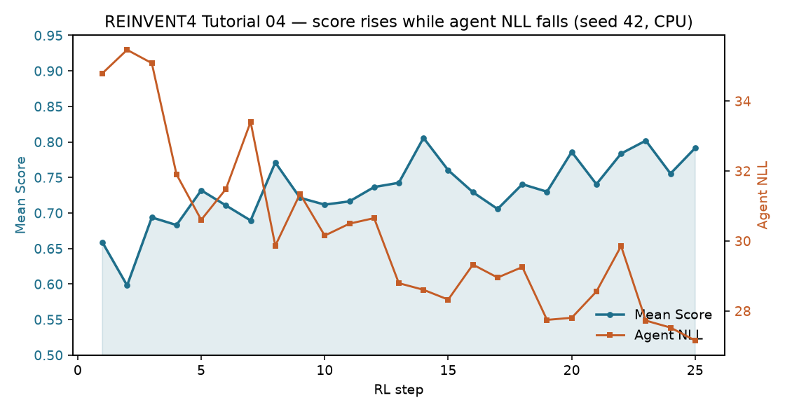
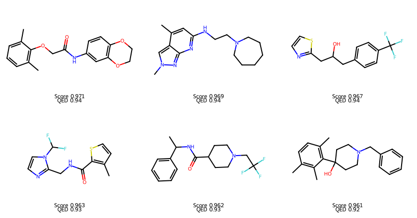

# REINVENT4 Tutorial 04: Reinforcement Learning

!!! abstract "Chapter 4 of the REINVENT4 course"
    In this chapter you train a generative **agent** with reinforcement learning
    so that molecules scoring well on the Tutorial 03 reward become more
    probable. You write a single-stage `staged_learning` TOML, run it on a plain
    **CPU**, and read the resulting `staged_learning_1.csv` plus a checkpoint.
    Everything here was run with seed **42** and is fully reproducible.

## Learning Objectives

After completing this chapter, you will be able to:

- [ ] Explain how `run_type = "staged_learning"` differs from `sampling` and
      `scoring`.
- [ ] State the roles of the **prior** (frozen reference) and the **agent**
      (trainable copy) during RL.
- [ ] Configure the **DAP** learning strategy (`sigma`, `rate`) and a single
      `[[stage]]` with termination criteria.
- [ ] Nest the Tutorial 03 scoring function correctly under `[stage.scoring]`.
- [ ] Interpret `staged_learning_1.csv` columns (`Score`, `Agent`, `Prior`,
      `Target`, `step`) and reuse the checkpoint as a new `agent_file`.

## Why It Matters

Scoring (Tutorial 03) answers: *"among these fixed molecules, which look
good?"* That never changes the generator. Drug discovery needs the opposite:
*"make more molecules like the good ones."*

Reinforcement learning is REINVENT4's answer. Each step the agent:

1. **Samples** a batch of SMILES.
2. **Scores** them with your reward function.
3. **Updates** its weights so high-scoring sequences become more likely — while
   the prior stays fixed as a chemical-grammar anchor (the DAP objective).

After enough steps the distribution of generated molecules drifts toward your
objectives (here: high QED, MW ≈ 200–500 Da, no alert SMARTS).

!!! tip "What you'll have by the end of this chapter"
    A file called `staged_learning_1.csv` (one row per sampled molecule per
    step) and a checkpoint `rl_agent.chkpt`. Key columns:

    | Column | Meaning |
    |--------|---------|
    | `Score` | aggregated reward for that molecule |
    | `Agent` / `Prior` | negative log-likelihood under agent / prior |
    | `Target` | DAP target log-likelihood (score-augmented) |
    | `step` | RL optimization step (1 … `max_steps`) |

    Mean Score rises while Agent NLL falls over 25 CPU steps:

    

## Hands-on Practice

### Prerequisites

- **Completed:** [Tutorial 01](01-installation-first-molecule.md) — REINVENT4
  installed and `priors/reinvent_pubchem.prior` downloaded.
- **Completed (concepts):** [Tutorial 03](03-scoring-function.md) — you
  understand components, transforms, and `geometric_mean`. You do **not** need
  to re-run scoring for this chapter.
- **OS:** Linux (Ubuntu 22.04/24.04 validated).
- **Python / env:** the same `reinvent4` (conda) or `reinvent4-env` (venv) from
  Tutorial 01.
- **GPU:** *Not required.* This chapter uses `device = "cpu"`. A GPU is faster
  for long runs (see Tutorial 12 later); 25 short steps finish on CPU in under
  a minute.
- **Disk/RAM:** peak RAM for this run was **~1.5 GiB**; the checkpoint is
  ~23 MB.
- **Tools:** `reinvent` CLI on your `PATH`.

Verify the CLI and prior:

```bash
reinvent --version
ls -lh priors/reinvent_pubchem.prior
```

```text
REINVENT 4.8.24 (C) AstraZeneca 2017, 2023 using PyTorch 2.12.0+cpu.
```

!!! info "Tutorial 02 is optional here"
    [Tutorial 02 — Prior Model](02-prior-model.md) goes deeper into how the
    prior was trained. For RL you only need the prior *file* from Tutorial 01
    and the scoring ideas from Tutorial 03.

#### Why these design choices? (read before training)

=== "Why copy the prior as the agent?"

    At step 0 the agent must already speak valid chemistry. Starting from the
    PubChem prior gives you a chemically competent policy; RL then *steers*
    that policy toward your score without teaching SMILES from scratch. In the
    TOML, `prior_file` and `agent_file` therefore point at the **same** `.prior`
    on the first run. After training, replace `agent_file` with the checkpoint
    to continue.

=== "Why DAP?"

    REINVENT's Direct Augmented Prior (DAP) reward compares agent and prior
    log-likelihoods and pulls the agent toward a score-augmented target. Only
    `type = "dap"` is supported in current REINVENT4. `sigma` scales how
    strongly the score reshapes the target; `rate` is the Adam learning rate.

=== "Why only 25 steps?"

    Production campaigns often run hundreds or thousands of steps. Twenty-five
    steps with `batch_size = 64` already show Score rising and Agent NLL falling
    on CPU (~27 s in our run) without turning the chapter into an overnight
    job. Treat this as a *learning* run; scale `max_steps` when you care about
    project-quality libraries.

=== "Why no diversity filter yet?"

    Diversity filters (scaffold buckets, SMILES penalties) change the effective
    reward and deserve their own chapter. Omitting `[diversity_filter]` keeps
    this tutorial focused on the RL loop. Tutorial 06 covers filters in depth;
    Tutorial 05 covers multi-stage curriculum learning.

### Step 1: Confirm the environment

Work from a directory that can see the prior (same layout as Tutorial 01):

```bash
# activate your Tutorial 01 environment first
reinvent --version
test -f priors/reinvent_pubchem.prior && echo "prior OK"
```

### Step 2: Write `rl.toml`

Create `rl.toml`. The scoring block is the Tutorial 03 function, nested under
**`stage.scoring`** (not a top-level `[scoring]` section):

```toml
run_type = "staged_learning"
device = "cpu"
json_out_config = "_rl.json"

[parameters]
summary_csv_prefix = "staged_learning"
prior_file = "priors/reinvent_pubchem.prior"
agent_file = "priors/reinvent_pubchem.prior"
batch_size = 64
randomize_smiles = true

[learning_strategy]
type = "dap"
sigma = 128
rate = 0.0001

[[stage]]
chkpt_file = "rl_agent.chkpt"
termination = "simple"
max_score = 1.0
min_steps = 5
max_steps = 25

[stage.scoring]
type = "geometric_mean"
parallel = 1

[[stage.scoring.component]]
[stage.scoring.component.custom_alerts]
[[stage.scoring.component.custom_alerts.endpoint]]
name = "Alerts"
# filter: no weight — applied globally
params.smarts = [
  "[*;r{8-17}]",   # rings with 8–17 atoms
  "[#8][#8]",      # peroxide-like O–O
  "[#6;+]",        # charged carbon
  "[#16][#16]",    # S–S
  "C#C"            # alkyne (illustrative)
]

[[stage.scoring.component]]
[stage.scoring.component.QED]
[[stage.scoring.component.QED.endpoint]]
name = "QED"
weight = 1.0

[[stage.scoring.component]]
[stage.scoring.component.MolecularWeight]
[[stage.scoring.component.MolecularWeight.endpoint]]
name = "MW"
weight = 1.0
transform.type = "double_sigmoid"
transform.low = 200.0
transform.high = 500.0
transform.coef_div = 500.0
transform.coef_si = 20.0
transform.coef_se = 20.0
```

**Why this config?**

| Piece | Role |
|-------|------|
| `run_type = "staged_learning"` | RL / curriculum entry point (even for one stage) |
| identical `prior_file` / `agent_file` | start agent as a copy of the prior |
| `batch_size = 64` | molecules sampled and scored per step |
| DAP `sigma = 128`, `rate = 1e-4` | REINVENT defaults — strong but stable for this prior |
| `max_steps = 25` | short, observable demo on CPU |
| stage scoring = T03 | same QED + MW + alerts the reader already trusts |

!!! warning "`[scoring]` vs `[stage.scoring]`"
    Inside staged learning every scoring key must be prefixed with `stage.`
    (e.g. `[stage.scoring]`, `[[stage.scoring.component]]`). A bare `[scoring]`
    section fails Pydantic validation. This is the #1 config mistake when
    copy-pasting from Tutorial 03.

### Step 3: Run reinforcement learning

```bash
reinvent -l rl.log -s 42 rl.toml
```

- `-l rl.log` writes the per-step Score / Agent NLL lines to a file.
- `-s 42` fixes the seed so your curves match this chapter.

On a multi-core CPU this finished in about **27 seconds** (~1.5 GiB peak RAM).
You should see log lines like:

```text
Score: 0.66 Agent NLL: 34.79 Valid:  98% Step: 1
...
Score: 0.79 Agent NLL: 27.15 Valid: 100% Step: 25
Maximum number of steps of 25 reached in stage 1. Terminating all stages.
```

Artifacts written next to `rl.toml`:

| File | Description |
|------|-------------|
| `staged_learning_1.csv` | every molecule from every step (`summary_csv_prefix` + `_1`) |
| `rl_agent.chkpt` | trained agent checkpoint (reuse as `agent_file`) |
| `_rl.json` | resolved config dump |
| `rl.log` | run log |

### Step 4: Inspect the summary CSV and checkpoint

```bash
# columns + first rows
head -n 3 staged_learning_1.csv

# mean Score at first and last step (needs pandas)
python - <<'PY'
import pandas as pd
df = pd.read_csv("staged_learning_1.csv")
print(df.groupby("step")["Score"].mean().loc[[1, 25]])
PY

ls -lh rl_agent.chkpt
```

To **continue** training later, point `agent_file` at the checkpoint (keep
`prior_file` as the original prior):

```toml
prior_file = "priors/reinvent_pubchem.prior"
agent_file = "rl_agent.chkpt"
```

### Common Errors

??? failure "`ValidationError` — Extra inputs are not permitted / missing stage scoring"
    Usually a TOML nesting mistake: scoring must live under `[stage.scoring]`
    with `[[stage.scoring.component]]` blocks. Also avoid obsolete keys that
    older blog posts mention (e.g. `unique_sequences` is not accepted by
    REINVENT 4.8.24's RL schema).

??? failure "`FileNotFoundError` — prior / checkpoint not found"
    Paths are relative to your **current working directory**. Run `reinvent`
    from the folder that contains `priors/`, or use absolute paths.

??? failure "Run is extremely slow / fans spin forever"
    You are on CPU with a large `batch_size` or `max_steps`. For this tutorial
    keep `batch_size = 64` and `max_steps = 25`. For long campaigns use a GPU
    (`device = "cuda:0"`) — covered later in Tutorial 12.

??? failure "Scores stay flat near zero"
    Debug the reward with Tutorial 03's `run_type = "scoring"` on a fixed SMILES
    list before blaming RL. Over-aggressive `CustomAlerts` or a broken MW
    transform will zero almost everything the agent samples.

??? failure "`RuntimeError: CUDA out of memory`"
    Set `device = "cpu"` or reduce `batch_size`. This chapter is designed for
    CPU.

## Code Walkthrough

Every important field in `rl.toml`, explained:

| Parameter | Value | Meaning |
|-----------|-------|---------|
| `run_type` | `"staged_learning"` | Reinforcement / curriculum learning mode. |
| `device` | `"cpu"` | Torch device for sampling and the agent update. |
| `json_out_config` | `"_rl.json"` | Optional dump of the resolved config. |
| `summary_csv_prefix` | `"staged_learning"` | Output CSV becomes `{prefix}_{stage}.csv`. |
| `prior_file` | `.prior` path | Frozen reference model (never updated). |
| `agent_file` | `.prior` or `.chkpt` | Trainable policy; checkpoint resumes training. |
| `batch_size` | `64` | Molecules generated per RL step. |
| `randomize_smiles` | `true` | Shuffle atom order in SMILES (data augmentation). |
| `learning_strategy.type` | `"dap"` | Direct Augmented Prior (only supported strategy). |
| `sigma` | `128` | How strongly Score reshapes the DAP target. |
| `rate` | `0.0001` | Adam learning rate for the agent. |
| `[[stage]]` | — | One stage = one scoring setup + termination rule. |
| `max_steps` | `25` | Hard stop for the whole run when reached. |
| `min_steps` | `5` | Do not early-stop before this many steps. |
| `max_score` | `1.0` | Early-stop if mean score exceeds this (after `min_steps`). |
| `chkpt_file` | `rl_agent.chkpt` | Checkpoint written at stage end (or Ctrl-C). |
| `stage.scoring.type` | `"geometric_mean"` | Same aggregation as Tutorial 03. |

!!! note "Prior vs Agent vs Target (CSV columns)"
    - **`Prior`** — NLL under the frozen prior. Low = molecule looks "prior-like".
    - **`Agent`** — NLL under the current agent. RL updates push Agent toward the Target.
    - **`Target`** — DAP's score-augmented target log-likelihood. High-Score
      molecules get a more demanding (higher) target, so the agent is rewarded
      for assigning them higher probability.

    Full parameter catalogue:
    [`configs/PARAMS.md`](https://github.com/MolecularAI/REINVENT4/blob/main/configs/PARAMS.md)
    (Staged Learning section).

## Expected Output

`staged_learning_1.csv` has one row per molecule per step. Excerpt from the
real seed-42 run
([download the sample](../../assets/reinvent4/04/rl-sample.csv)):

```text
step,SMILES,Score,QED,MW,Alerts,QED (raw),MW (raw),Agent,Prior,Target
1,NC(=O)C(CCOCc1ccccc1)c1ccccc1,0.8857,0.7857,0.9983,1.0000,0.7857,269.3440,24.4089,24.4089,88.9566
1,CC(C)(C)CN1COCC1CN,0.2190,0.6644,0.0722,1.0000,0.6644,172.2720,25.8254,25.8254,2.2028
1,COc1ccc(CNc2nc(-c3cccnc3)ns2)c(OC)c1,0.8655,0.7490,1.0000,1.0000,0.7490,328.3970,29.3209,29.3209,81.4596
25,Cc1cccc(C)c1OCC(=O)Nc1ccc2c(c1)OCCO2,0.9706,0.9422,1.0000,1.0000,0.9422,313.3530,21.6997,23.2911,100.9502
25,CS(=O)(=O)c1ccc2c(c1)nc(C1CCOCC1)n2CCO,0.9578,0.9173,1.0000,1.0000,0.9173,324.4020,30.6543,30.6783,91.9140
```

Summary statistics from this run (25 steps × batch 64 = **1600** scored
molecules, seed 42, CPU):

| Metric | Value |
|--------|-------|
| Mean `Score` at step 1 → 25 | 0.66 → 0.79 |
| Median `Score` at step 1 → 25 | 0.81 → 0.86 |
| Fraction with `Score` > 0.8 (step 1 → 25) | 53% → 66% |
| Agent NLL (log) at step 1 → 25 | 34.79 → 27.15 |
| CustomAlerts failures (all steps) | 54 / 1600 |
| Wall-clock | ~27 s |
| Peak memory | ~1465 MiB |
| Checkpoint size | ~23 MB (`rl_agent.chkpt`) |

High-scoring molecules from late steps (Score ≥ 0.96):



How to read the trend:

1. **Score up** — the batch-average reward climbs; more molecules land in the
   QED/MW sweet spot.
2. **Agent NLL down** — the agent assigns higher probability (lower NLL) to the
   molecules it now prefers.
3. **Prior stays the anchor** — DAP keeps the agent from drifting into
   chemically nonsense space just to chase Score.

## Think About It

1. **At step 1, why are `Agent` and `Prior` almost identical for each row?**
   The agent was initialized as a copy of the prior. Before updates, their NLLs
   match; after training they diverge.
2. **Why can a single step's mean Score dip even while the overall trend rises?**
   Each batch is a stochastic sample. Look at the curve over many steps, not one
   noisy point.
3. **What would happen if `sigma` were tiny (e.g. 1)?** The score would barely
   reshape the DAP target — RL would crawl. Very large `sigma` can overfit to
   the reward and hurt validity / prior-likeness.
4. **Why keep `prior_file` fixed when resuming from `rl_agent.chkpt`?** The prior
   is the chemical reference in DAP. Replacing it with the checkpoint would
   remove that anchor.
5. **Is `max_score = 1.0` useful in this demo?** Almost never triggers with a
   geometric mean of imperfect components. It matters more when you set a
   realistic threshold (e.g. 0.8) for early stopping.

## Exercises

1. **Easy:** Re-run with `max_steps = 50` (same seed). Plot mean Score vs step.
   Does the curve keep rising, plateau, or oscillate?
2. **Medium:** Change only `sigma` to `64` and then to `256` (two runs). Compare
   final mean Score and validity % from the log. Which setting looks more
   stable?
3. **Challenge:** After the 25-step run, set `agent_file = "rl_agent.chkpt"`,
   raise `max_steps` to 25 again, and continue. Confirm the new CSV's early
   steps already sit near the previous final Score — evidence that the
   checkpoint restored the trained policy.

## Further Reading

- [REINVENT4 `configs/PARAMS.md`](https://github.com/MolecularAI/REINVENT4/blob/main/configs/PARAMS.md) — staged learning, learning strategy, and stage parameters.
- [REINVENT4 `configs/staged_learning.toml`](https://github.com/MolecularAI/REINVENT4/blob/main/configs/staged_learning.toml) — official multi-stage example.
- Loeffler et al., *REINVENT 4: Modern AI-driven generative molecule design*, **J. Cheminformatics** (2024). [Open Access](https://doi.org/10.1186/s13321-024-00812-5).
- Handbook: [Tutorial 03 — Scoring Function](03-scoring-function.md).

---

**Next chapter:** [Tutorial 05 — Curriculum Learning](05-curriculum-learning.md),
where multiple `[[stage]]` blocks (or checkpoint hand-offs) escalate objectives
over the course of training.
