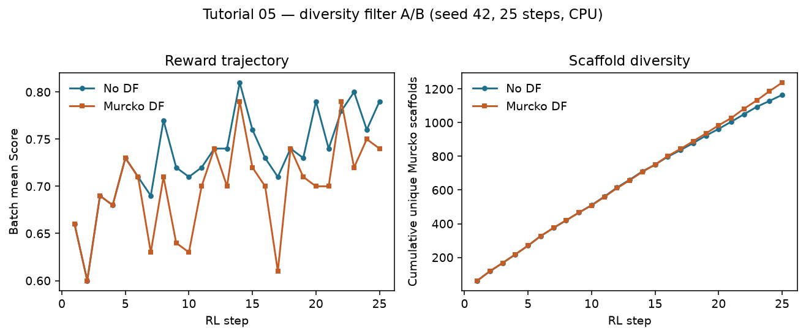
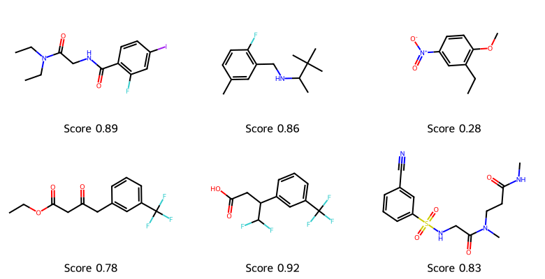

# REINVENT4 Tutorial 05: Diversity Filter

!!! abstract "Chapter 5 of the REINVENT4 course"
    Tutorial 04 showed Score rising under plain RL. This chapter treats
    **diversity** as an experimental control: you rerun the same 25-step CPU
    campaign **with** and **without** an `IdenticalMurckoScaffold` diversity
    filter, then judge the trade-off between mean Score and scaffold
    occupancy. Seed **42**, fully reproducible.

## Learning Objectives

After completing this chapter, you will be able to:

- [ ] Explain *mode collapse* in generative RL and why a high Score alone is
      not success.
- [ ] Configure a global `[diversity_filter]` (`IdenticalMurckoScaffold`,
      `bucket_size`, `minscore`) on a `staged_learning` run.
- [ ] Run an A/B comparison at fixed seed and compare cumulative Murcko
      scaffolds, top-scaffold occupancy, and Score trajectories.
- [ ] State the trade-off you accept (reward vs diversity) for a given
      `bucket_size` / `minscore`.
- [ ] Know which filter types exist — without treating PARAMS.md as the chapter.

## Why It Matters

Without a diversity pressure, RL happily rediscovers the same easy scaffold
with small side-chain edits. Your CSV looks great; chemistry gets twenty
near-duplicates.

A diversity filter **memorizes scaffolds** (or SMILES) that already scored well
and down-weights further hits in the same bucket. That lowers batch-mean Score
slightly and raises the chance the library is worth enumerating.

!!! tip "What you'll have by the end of this chapter"
    Two `summary_*.csv` files from identical RL setups except the filter, and
    a measured trade-off:

    | Metric (25 steps × batch 64) | No DF | Murcko DF |
    |------------------------------|-------|-----------|
    | Mean Score at step 25 | **0.79** | **0.74** |
    | Unique Murcko scaffolds | 1165 | **1238** |
    | Count of top scaffold (`c1ccccc1`) | 120 | **101** |

    

## Hands-on Practice

### Prerequisites

- **Completed:** [Tutorial 04](04-reinforcement-learning.md) — you understand
  `staged_learning`, DAP, and the QED + MW + alerts scoring function.
- **Completed (concepts):** [Tutorial 03](03-scoring-function.md).
- **OS / env / prior:** same as Tutorial 01/04 (`reinvent_pubchem.prior`).
- **GPU:** *Not required.* Each leg ~27–28 s on CPU; peak RAM similar to T04
  (~1.5 GiB).

```bash
reinvent --version
test -f priors/reinvent_pubchem.prior && echo "prior OK"
```

#### Why these design choices?

=== "Why A/B at the same seed?"

    Seed 42 makes step-1 batches match; differences after that are attributable
    to the filter (plus stochastic sampling). Never compare "DF on GPU" to
    "no DF on CPU" and call it science.

=== "Why IdenticalMurckoScaffold?"

    Bemis–Murcko scaffolds are the usual medicinal-chemistry notion of "same
    core." Other types (`IdenticalTopologicalScaffold`, `ScaffoldSimilarity`,
    `PenalizeSameSmiles`) change the memory key — pick one hypothesis per
    experiment.

=== "Why `bucket_size = 25` and `minscore = 0.4`?"

    Defaults from the official staged-learning example. `minscore` ignores junk
    molecules so the memory is not filled with failures. `bucket_size` is the
    knob you will ablate in the exercises.

=== "Why still only 25 steps?"

    Collapse and filter effects already appear. Longer runs amplify both the
    Score gap and the diversity gap — Tutorial 09/10 scale and ablate.

### Step 1: Baseline — RL without a diversity filter

Reuse the Tutorial 04 config (single stage, same scoring). Save as
`rl_no_df.toml` with `summary_csv_prefix = "rl_no_df"` and
`chkpt_file = "rl_no_df.chkpt"`.

```bash
reinvent -l rl_no_df.log -s 42 rl_no_df.toml
```

You get `rl_no_df_1.csv`. This is the **control** arm.

### Step 2: Treatment — add `[diversity_filter]`

Copy the file to `rl_with_df.toml`. Change the CSV prefix / checkpoint names,
and insert **before** `[[stage]]`:

```toml
[diversity_filter]
type = "IdenticalMurckoScaffold"
bucket_size = 25
minscore = 0.4
```

Keep `[learning_strategy]`, `[[stage]]`, and `[stage.scoring]` identical to the
control.

```bash
reinvent -l rl_with_df.log -s 42 rl_with_df.toml
```

### Step 3: Compare scaffolds and scores

```bash
python - <<'PY'
import re, csv
from collections import Counter
from rdkit import Chem
from rdkit.Chem.Scaffolds import MurckoScaffold

def murcko(smi):
    m = Chem.MolFromSmiles(smi)
    return MurckoScaffold.MurckoScaffoldSmiles(mol=m) if m else None

def summarize(csv_path, log_path):
    rows = list(csv.DictReader(open(csv_path)))
    scafs = [murcko(r["SMILES"]) for r in rows]
    scafs = [s for s in scafs if s]
    scores = {}
    for sc, nll, v, st in re.findall(
        r"Score:\s*([0-9.]+)\s+Agent NLL:\s*([0-9.]+)\s+Valid:\s*([0-9.]+)%\s+Step:\s*(\d+)",
        open(log_path).read(),
    ):
        scores[int(st)] = float(sc)
    top = Counter(scafs).most_common(1)[0]
    print(csv_path)
    print("  unique scaffolds", len(set(scafs)), "top", top,
          "score@25", scores.get(25))

summarize("rl_no_df_1.csv", "rl_no_df.log")
summarize("rl_with_df_1.csv", "rl_with_df.log")
PY
```

### Common Errors

??? failure "DF section ignored / no effect"
    Global `[diversity_filter]` must be a top-level table (sibling of
    `[parameters]`), not nested under `[[stage]]`, unless you intentionally use
    a per-stage filter *and* remove the global one (global wins if both exist).

??? failure "Almost every Score becomes zero mid-run"
    `bucket_size` too small for your batch size, or `minscore` too low so junk
    fills memory. Raise `bucket_size` or `minscore` and rerun the A/B.

??? failure "Step-1 metrics differ between arms"
    Seeds or TOMLs drifted. Diff the two configs; only DF block and output
    names should change.

??? failure "Expecting DF to invent new chemistry"
    Filters **penalize repetition**; they do not add a generative prior. Dead
    chemotypes stay dead — fix scoring or the prior (Tutorials 02–03).

## Code Walkthrough

| Parameter | Value | Meaning |
|-----------|-------|---------|
| `diversity_filter.type` | `IdenticalMurckoScaffold` | Memory key = Murcko scaffold. |
| `bucket_size` | `25` | How many high-scoring hits per scaffold before heavy penalty. |
| `minscore` | `0.4` | Only memorize molecules at/above this Score. |
| `minsimilarity` | (unused here) | For `ScaffoldSimilarity` only. |
| `penalty_multiplier` | (unused here) | For `PenalizeSameSmiles` only. |
| `purge_memories` | default `true` | Clears DF memory between stages (multi-stage → Tutorial 06). |

!!! note "Filter-type cheat sheet (decision, not a catalog dump)"

    | Type | Use when… |
    |------|-----------|
    | `IdenticalMurckoScaffold` | You care about distinct cores (default lab choice). |
    | `IdenticalTopologicalScaffold` | You want a stricter graph-level core. |
    | `ScaffoldSimilarity` | Near-duplicate cores should share a bucket (`minsimilarity`). |
    | `PenalizeSameSmiles` | Exact SMILES repeats are the failure mode. |

## Expected Output

Seed-42 A/B (25 steps, `batch_size = 64`, same scoring as Tutorial 04):

| Metric | No DF | Murcko DF (`bucket_size=25`) |
|--------|-------|------------------------------|
| Rows | 1600 | 1600 |
| Mean Score step 1 | 0.66 | 0.66 (matched) |
| Mean Score step 25 | **0.79** | **0.74** |
| Unique Murcko scaffolds | 1165 | **1238** |
| Occupancy of top scaffold | 120 | **101** |
| Max scaffold count in steps 20–25 | 32 | **20** |
| Wall-clock | ~27 s | ~28 s |

CSV snippets:
[rl-no-df-sample.csv](../../assets/reinvent4/05/rl-no-df-sample.csv),
[rl-with-df-sample.csv](../../assets/reinvent4/05/rl-with-df-sample.csv).

Molecules sharing the most frequent scaffold (phenyl / `c1ccccc1` is common —
watch **counts**, not the fact that phenyl appears):




**How to read the trade-off:** DF cost ~0.05 mean Score by step 25 and bought
~70 additional scaffolds plus a thinner top bucket. Whether that is "worth it"
depends on whether chemistry wants breadth or a single optimized series.

## Think About It

1. **Why do step-1 Scores match exactly?** The filter has an empty memory; until
   buckets fill, both arms are the same policy + scoring function.
2. **Why is `c1ccccc1` still #1 with DF on?** Murcko of many substituted
   benzenes *is* benzene. DF limits how many can sit in that bucket — it does
   not ban phenyl.
3. **Would a higher Score without DF win a paper figure?** Only if you disclose
   scaffold collapse. Libraries of clones are not a campaign success.
4. **How does this interact with Tutorial 02's TL prior?** A narrow TL prior +
   no DF is the fastest way to paint one chemotype forever. Turn DF on earlier
   when the prior is already focused.

## Exercises

1. **Easy:** Set `bucket_size = 10` and rerun the DF arm only (seed 42). What
   happens to Score@25 and unique scaffolds vs `bucket_size = 25`?
2. **Medium:** Raise `minscore` to `0.7`. Does the top-scaffold occupancy rise
   again (memory ignores mid-score molecules)?
3. **Challenge:** Switch to `PenalizeSameSmiles` with `penalty_multiplier = 0.5`.
   Compare unique SMILES and unique scaffolds to Murcko DF — which failure mode
   did you actually fix?

## Further Reading

- [REINVENT4 `configs/PARAMS.md`](https://github.com/MolecularAI/REINVENT4/blob/main/configs/PARAMS.md) — diversity filter parameters.
- [REINVENT4 `configs/staged_learning.toml`](https://github.com/MolecularAI/REINVENT4/blob/main/configs/staged_learning.toml) — official DF example block.
- Loeffler et al., *REINVENT 4*, **J. Cheminformatics** (2024).
- Handbook: [Tutorial 04 — Reinforcement Learning](04-reinforcement-learning.md).

---

**Next chapter:** [Tutorial 06 — Curriculum Learning](06-curriculum-learning.md),
where multiple stages escalate objectives on top of a controlled diversity
setup.
