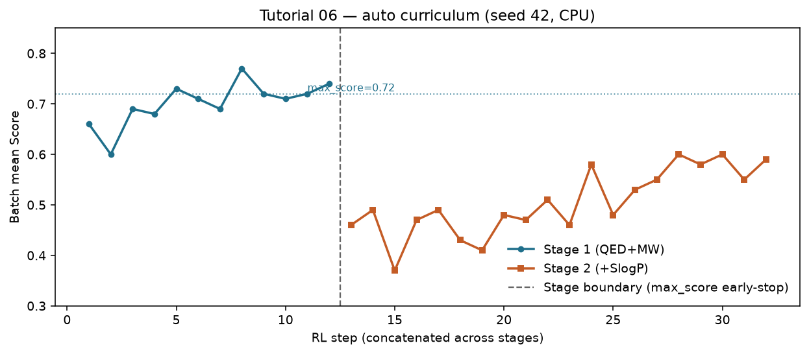
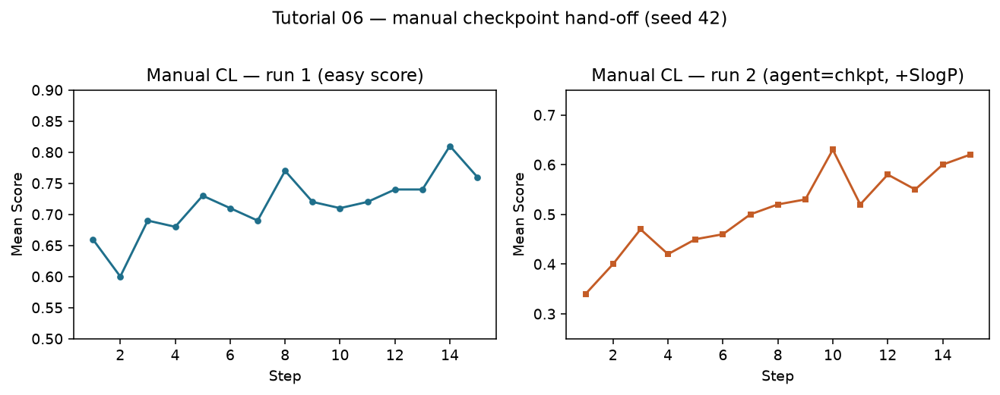
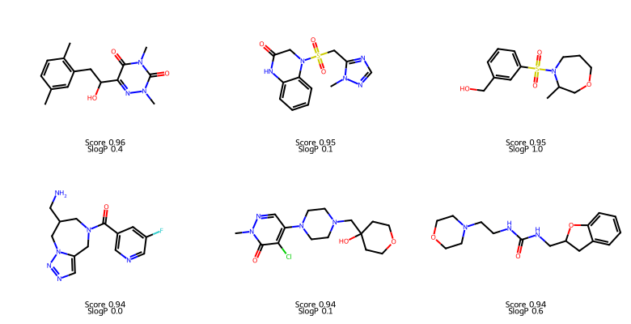

# REINVENT4 Tutorial 06: Curriculum Learning

!!! abstract "Chapter 6 of the REINVENT4 course"
    Tutorial 04 trained a single-stage agent. This chapter treats **curriculum
    learning** as a research design: you escalate the scoring function across
    stages so the agent masters an easy multi-parameter objective first, then
    faces a harder one. You run an **automatic** two-stage `staged_learning`
    job on CPU (seed **42**) and contrast it with a **manual** checkpoint
    hand-off. Fully reproducible.

## Learning Objectives

After completing this chapter, you will be able to:

- [ ] Explain why REINVENT4 curriculum learning is multi-stage RL with
      *different scoring setups*, not a separate algorithm.
- [ ] Configure two `[[stage]]` blocks so stage 1 **early-stops** via
      `max_score` / `min_steps` and stage 2 actually starts.
- [ ] State the critical pitfall: hitting `max_steps` in a stage **aborts all
      later stages**.
- [ ] Escalate objectives (here: add `SlogP` in stage 2) and read
      `curriculum_1.csv` / `curriculum_2.csv`.
- [ ] Run the same science as a **manual** curriculum (`agent_file` =
      stage-1 checkpoint).

## Why It Matters

A single hard reward from step 1 often yields noisy, low Scores: the agent has
not yet learned “drug-like + right size,” and you immediately demand LogP as
well. Medicinal chemistry rarely works that way — you stabilize a series, then
tighten ADMET.

Curriculum learning in REINVENT4 is exactly that schedule:

1. **Stage 1** — easier scoring (Tutorial 04 stack: QED + MW + alerts).
2. **Stage 2** — harder MPO (same stack **plus** SlogP with a reverse sigmoid).

Official docs call this *auto CL* (multiple `[[stage]]` in one TOML) versus
*manual CL* (stop, point `agent_file` at a checkpoint, start a new TOML).

!!! tip "What you'll have by the end of this chapter"
    From the seed-42 auto run (~29 s, ~1.5 GiB peak):

    | Event | Result |
    |-------|--------|
    | Stage 1 length | **12** steps (early-stop at mean Score **0.74** > `max_score = 0.72`) |
    | Stage 2 length | **20** steps (ran to `max_steps`) |
    | Stage 2 Score | **0.46 → 0.59** after the harder reward shock |

    

## Hands-on Practice

### Prerequisites

- **Completed:** [Tutorial 04](04-reinforcement-learning.md) — single-stage
  `staged_learning`, DAP, QED + MW scoring.
- **Helpful:** [Tutorial 05](05-diversity-filter.md) — diversity filters (this
  chapter omits DF on purpose so curriculum is the only new variable).
- **OS / env / prior:** Tutorial 01 setup; `priors/reinvent_pubchem.prior`.
- **GPU:** *Not required.*

```bash
reinvent --version
test -f priors/reinvent_pubchem.prior && echo "prior OK"
```

```text
REINVENT 4.8.24 (C) AstraZeneca 2017, 2023 using PyTorch 2.12.0+cpu.
```

#### Why these design choices?

=== "Why escalate the score instead of training longer on one score?"

    Longer single-stage runs optimize *one* surface. Curriculum changes the
    surface after the agent is competent on the easy objectives — closer to how
    project criteria tighten over time.

=== "Why must stage 1 hit `max_score`, not `max_steps`?"

    In REINVENT4, if a stage ends because **`max_steps` was reached**, the
    runner **terminates all remaining stages**. Auto curriculum only advances
    when the stage terminator fires on **`max_score` after `min_steps`**.
    Treat stage-1 `max_steps` as a safety ceiling.

=== "Why add SlogP in stage 2?"

    Geometric mean of QED × MW × SlogP is strictly harder than QED × MW. You
    will see an immediate Score drop at the stage boundary — evidence the
    reward changed — then a climb as the agent adapts. `reverse_sigmoid`
    prefers lower SlogP (illustrative Lipinski-like pressure).

=== "Why no diversity filter here?"

    Tutorial 05 already A/B-tested DF. Combining DF + curriculum in one first
    demo confounds which knob moved the curves. Add DF back once both are clear
    (`purge_memories` controls whether DF memory clears between stages).

### Step 1: Write `curriculum.toml` (auto multi-stage)

```toml
run_type = "staged_learning"
device = "cpu"
json_out_config = "_curriculum.json"

[parameters]
summary_csv_prefix = "curriculum"
prior_file = "priors/reinvent_pubchem.prior"
agent_file = "priors/reinvent_pubchem.prior"
batch_size = 64
randomize_smiles = true

[learning_strategy]
type = "dap"
sigma = 128
rate = 0.0001

# ----- Stage 1: easy MPO (must early-stop via max_score) -----
[[stage]]
chkpt_file = "cl_stage1.chkpt"
termination = "simple"
max_score = 0.72
min_steps = 10
max_steps = 40

[stage.scoring]
type = "geometric_mean"
parallel = 1

[[stage.scoring.component]]
[stage.scoring.component.custom_alerts]
[[stage.scoring.component.custom_alerts.endpoint]]
name = "Alerts"
params.smarts = [
  "[*;r{8-17}]",
  "[#8][#8]",
  "[#6;+]",
  "[#16][#16]",
  "C#C"
]

[[stage.scoring.component]]
[stage.scoring.component.QED]
[[stage.scoring.component.QED.endpoint]]
name = "QED"
weight = 1.0

[[stage.scoring.component]]
[stage.scoring.component.MolecularWeight]
[[stage.scoring.component.MolecularWeight.endpoint]]
name = "MW"
weight = 1.0
transform.type = "double_sigmoid"
transform.low = 200.0
transform.high = 500.0
transform.coef_div = 500.0
transform.coef_si = 20.0
transform.coef_se = 20.0

# ----- Stage 2: harder MPO (+ SlogP) -----
[[stage]]
chkpt_file = "cl_stage2.chkpt"
termination = "simple"
max_score = 1.0
min_steps = 10
max_steps = 20

[stage.scoring]
type = "geometric_mean"
parallel = 1

[[stage.scoring.component]]
[stage.scoring.component.custom_alerts]
[[stage.scoring.component.custom_alerts.endpoint]]
name = "Alerts"
params.smarts = [
  "[*;r{8-17}]",
  "[#8][#8]",
  "[#6;+]",
  "[#16][#16]",
  "C#C"
]

[[stage.scoring.component]]
[stage.scoring.component.QED]
[[stage.scoring.component.QED.endpoint]]
name = "QED"
weight = 1.0

[[stage.scoring.component]]
[stage.scoring.component.MolecularWeight]
[[stage.scoring.component.MolecularWeight.endpoint]]
name = "MW"
weight = 1.0
transform.type = "double_sigmoid"
transform.low = 200.0
transform.high = 500.0
transform.coef_div = 500.0
transform.coef_si = 20.0
transform.coef_se = 20.0

[[stage.scoring.component]]
[stage.scoring.component.SlogP]
[[stage.scoring.component.SlogP.endpoint]]
name = "SlogP"
weight = 1.0
transform.type = "reverse_sigmoid"
transform.high = 4.0
transform.low = 0.0
transform.k = 0.5
```

**Why these termination numbers?**

| Knob | Stage 1 | Stage 2 | Role |
|------|---------|---------|------|
| `min_steps` | 10 | 10 | Do not early-stop before this many steps |
| `max_score` | **0.72** | 1.0 | Stage 1 exits when batch mean Score exceeds 0.72 |
| `max_steps` | 40 | **20** | Stage 1 safety; stage 2 budget (then run ends) |

On seed 42, Tutorial 04-style scoring already reaches ~0.74 by step 12 — so
`max_score = 0.72` is deliberately achievable.

### Step 2: Run automatic curriculum

```bash
reinvent -l curriculum.log -s 42 curriculum.toml
```

You should see both stages in the log:

```text
Starting stage 1 <<<
Score: 0.66 ... Step: 1
...
Score: 0.74 ... Step: 12
Finished stage 1 >>>
Starting stage 2 <<<
Score: 0.46 ... Step: 1
...
Score: 0.59 ... Step: 20
Maximum number of steps of 20 reached in stage 2. Terminating all stages.
```

Artifacts:

| File | Meaning |
|------|---------|
| `curriculum_1.csv` | Stage 1 molecules (no SlogP columns) |
| `curriculum_2.csv` | Stage 2 molecules (includes `SlogP` / `SlogP (raw)`) |
| `cl_stage1.chkpt` / `cl_stage2.chkpt` | Checkpoints after each stage |

Wall-clock for this chapter’s run: **~29 s**; peak RAM **~1472 MiB**.

### Step 3: Manual curriculum (checkpoint hand-off)

Same science, two processes.

**Run 1** — easy score only, fixed 15 steps (`manual_s1.toml`): same stage-1
scoring as above, single `[[stage]]`, `max_steps = 15`,
`chkpt_file = "manual_s1.chkpt"`, `max_score = 1.0` (force full budget).

```bash
reinvent -l manual_s1.log -s 42 manual_s1.toml
```

**Run 2** — harder score, start from the checkpoint:

```toml
# inside [parameters] of manual_s2.toml
prior_file = "priors/reinvent_pubchem.prior"
agent_file = "manual_s1.chkpt"   # <-- trained agent, prior stays frozen
```

Stage scoring = stage-2 block (with SlogP); `max_steps = 15`.

```bash
reinvent -l manual_s2.log -s 42 manual_s2.toml
```

Log must say `Agent read from manual_s1.chkpt`. Seed-42 manual leg: stage-1
Scores match the auto run’s early steps; stage-2 recovers **0.34 → 0.62** over
15 steps (~15 s).



| Mode | When to use |
|------|-------------|
| Auto (multi-`[[stage]]`) | One command; stage 1 must early-stop on `max_score` |
| Manual (`agent_file` = chkpt) | Inspect / edit scoring between stages; resume after Ctrl-C |

### Common Errors

??? failure "Stage 2 never starts — only `curriculum_1.csv`"
    Stage 1 hit `max_steps` before `max_score`. Lower stage-1 `max_score`,
    raise `max_steps` safety ceiling, or confirm Scores can exceed the
    threshold (debug with Tutorial 03 / 04 first).

??? failure "`ValidationError` on bare `[scoring]` inside a stage"
    Use `[stage.scoring]` and `[[stage.scoring.component]]` — same trap as
    Tutorial 04.

??? failure "Manual run 2 looks like a cold start"
    `agent_file` still points at the prior. It must be the stage-1
    `.chkpt`. Keep `prior_file` as the original prior for DAP.

??? failure "Stage 2 Score collapses and never recovers"
    Harder MPO is expected to drop Score at the boundary. If it stays near
    zero, the new component/transform may be mis-scaled — re-check SlogP
    `reverse_sigmoid` bounds with a fixed SMILES list (`run_type = "scoring"`).

## Code Walkthrough

| Parameter | Value | Meaning |
|-----------|-------|---------|
| `[[stage]]` | ×2 | One stage = one scoring setup + termination rule |
| `max_score` | `0.72` / `1.0` | Early-stop threshold (after `min_steps`) |
| `min_steps` | `10` | No early-stop before this many steps |
| `max_steps` | `40` / `20` | Per-stage ceiling; **hitting it aborts later stages** |
| `chkpt_file` | `cl_stage*.chkpt` | Written at stage end; reusable as `agent_file` |
| `summary_csv_prefix` | `curriculum` | Files `curriculum_{stage_no}.csv` |
| Stage-2 `SlogP` | `reverse_sigmoid` | Extra objective that tightens the geometric mean |
| `purge_memories` | (default) | If you add a DF later: clear memory between stages or not |

!!! note "Early-stop vs max_steps (read this twice)"
    - **Early-stop (`max_score`)** → stage finishes “successfully” → next
      `[[stage]]` runs.
    - **`max_steps` reached** → REINVENT logs *Terminating all stages* → no
      further curriculum.

    Full reference:
    [`configs/PARAMS.md`](https://github.com/MolecularAI/REINVENT4/blob/main/configs/PARAMS.md)
    (Staged Learning) and
    [`configs/staged_learning.toml`](https://github.com/MolecularAI/REINVENT4/blob/main/configs/staged_learning.toml).

## Expected Output

### Auto curriculum (seed 42)

| Metric | Value |
|--------|-------|
| Stage 1 steps | 12 (Score 0.66 → **0.74**) |
| Stage 1 exit | early-stop (`max_score = 0.72`) |
| Stage 2 steps | 20 (Score **0.46 → 0.59**) |
| Stage 2 columns | adds `SlogP`, `SlogP (raw)` |
| Wall-clock | ~29 s |
| Peak memory | ~1472 MiB |

CSV snippets:
[curriculum-stage1-sample.csv](../../assets/reinvent4/06/curriculum-stage1-sample.csv),
[curriculum-stage2-sample.csv](../../assets/reinvent4/06/curriculum-stage2-sample.csv).

High-scoring molecules from late stage 2:



### How to read the stage boundary

1. **Score cliff at stage 2 step 1** — geometric mean now includes SlogP; many
   molecules that looked fine on QED+MW lose reward.
2. **Climb inside stage 2** — the *same* agent weights continue; DAP pulls
   toward the new target.
3. **Separate CSVs** — do not concatenate rows blindly without a stage label;
   column sets differ.

## Think About It

1. **What would happen if stage 1 used `max_score = 0.95`?** Likely never
   early-stops; you hit `max_steps = 40` and **never enter stage 2**.
2. **Why keep the prior file unchanged when resuming from a checkpoint?** DAP
   still needs the frozen prior as the chemical anchor; only the agent path
   should be the checkpoint.
3. **Is a lower stage-2 Score a failure?** Not by itself — the metric changed.
   Compare stage-2 *trends* and component `(raw)` columns, not absolute Score
   against stage 1.
4. **When is manual CL better than auto?** When you need to inspect
   `curriculum_1.csv`, retune transforms, or continue tomorrow on another
   machine.

## Exercises

1. **Easy:** Set stage-1 `max_score = 0.68` and rerun (`-s 42`). Does stage 1
   end earlier? How does stage-2 starting Score change?
2. **Medium:** In stage 2 only, change SlogP `transform.high` from `4.0` to
   `3.0` (stricter). Compare final mean Score and mean `SlogP (raw)`.
3. **Challenge:** Three stages — (1) QED only, (2) QED+MW, (3) QED+MW+SlogP —
   each early-stopping on a documented `max_score`. Plot Score with two stage
   boundaries.

## Further Reading

- [REINVENT4 `configs/PARAMS.md`](https://github.com/MolecularAI/REINVENT4/blob/main/configs/PARAMS.md) — staged learning termination semantics.
- [REINVENT4 `configs/staged_learning.toml`](https://github.com/MolecularAI/REINVENT4/blob/main/configs/staged_learning.toml) — official multi-stage example.
- Loeffler et al., *REINVENT 4*, **J. Cheminformatics** (2024). [Open Access](https://doi.org/10.1186/s13321-024-00812-5).
- Handbook: [Tutorial 04 — Reinforcement Learning](04-reinforcement-learning.md), [Tutorial 05 — Diversity Filter](05-diversity-filter.md).

---

**Next chapter:** [Tutorial 07 — Transfer Learning](07-transfer-learning.md),
where you adapt the prior to project chemistry *before* (or beside) long RL —
building on the short TL taste in Tutorial 02.
