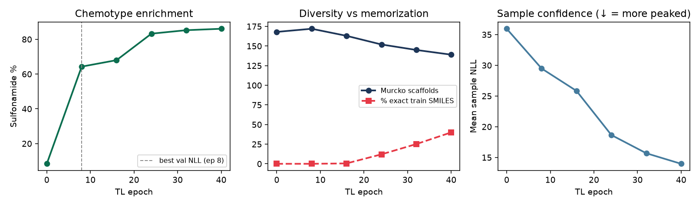
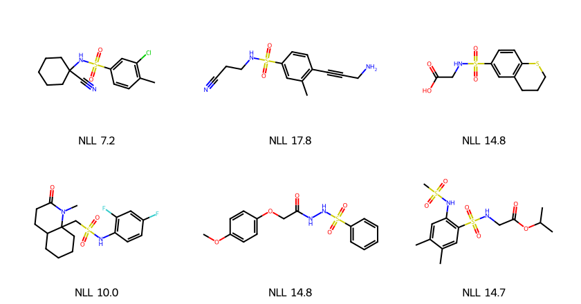
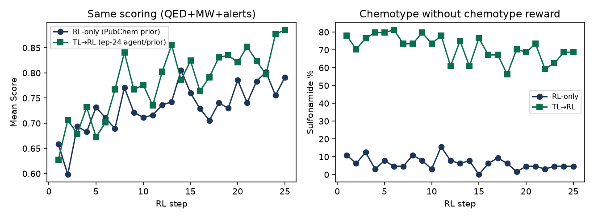

# REINVENT4 Tutorial 07: Transfer Learning

!!! abstract "Chapter 7 of the REINVENT4 course"
    Tutorial 02 gave you an **8-epoch** sulfonamide TL taste. This chapter treats
    transfer learning as a **research decision**: longer training, validation
    curves, overfitting symptoms, and a controlled **TL→RL vs RL-only** A/B under
    the *same* scoring function and seed budget. Everything ran on **CPU**, seed
    **42**, and is fully reproducible.

## Learning Objectives

After completing this chapter, you will be able to:

- [ ] Fine-tune the PubChem prior on a documented SMILES set and report sample
      NLL, chemotype hit rate, and validity before vs after.
- [ ] Read **validation NLL** and decide which checkpoint to keep (not “last
      epoch”).
- [ ] Recognize overfitting: collapsed Murcko diversity, memorized training
      SMILES, fewer unique samples at fixed `num_smiles`.
- [ ] Run **TL→RL** (TL checkpoint as both `prior_file` and `agent_file`) vs
      **RL-only** with identical scoring and `max_steps`.
- [ ] State when TL helps (domain shift) vs when RL alone is enough.

## Why It Matters

Official docs show `run_type = "transfer_learning"`. Lab work asks:

> *Did I adapt the prior enough — without memorizing my tiny set?*

A short TL (Tutorial 02) can enrich a chemotype cheaply. Longer TL on the same
tiny set often **overfits**: sulfonamide % keeps climbing while scaffolds fall
and exact training SMILES reappear in samples. Feeding an overfit checkpoint
into RL wastes the DAP prior as a chemical anchor.

This chapter keeps the Tutorial 02 sulfonamide set, trains **40 epochs** with
checkpoints every 8, then compares:

| Arm | `prior_file` / `agent_file` | Scoring | Steps |
|-----|-----------------------------|---------|-------|
| RL-only | PubChem prior | QED + MW + alerts (Tutorial 04) | 25 |
| TL→RL | TL epoch-**24** checkpoint | *same* | 25 |

!!! tip "What you'll have by the end of this chapter"
    Seed-42 numbers from this handbook run:

    | Epoch | Sulfonamide % | Murcko scaffolds | % exact train SMILES | Mean NLL |
    |------:|--------------:|-----------------:|---------------------:|---------:|
    | 0 (prior) | **8.4** | 168 | 0.0 | 35.95 |
    | 8 | 64.3 | 172 | 0.0 | 29.48 |
    | 24 | 83.3 | 152 | **12.0** | 18.65 |
    | 40 | 86.1 | 139 | **40.0** | 13.97 |

    Best **validation** NLL was at epoch **8**. TL→RL still beats RL-only on
    Score *and* keeps the chemotype under a reward that does **not** pay for
    sulfonamides.

    

## Hands-on Practice

### Prerequisites

- **Completed:** [Tutorial 01](01-installation-first-molecule.md) — prior on disk.
- **Completed:** [Tutorial 02](02-priors-in-practice.md) — short TL concept (or
  use the shipped `.smi` files below).
- **Completed:** [Tutorial 04](04-reinforcement-learning.md) — single-stage RL.
- **OS / env:** same `reinvent4` / `reinvent4-env` as Tutorial 01.
- **GPU:** *Not required* (`device = "cpu"`).
- **Disk/RAM:** TL peaked at **~920 MiB**; each RL leg ~**1.4–1.5 GiB**.

```bash
reinvent --version
test -f priors/reinvent_pubchem.prior && echo "prior OK"
```

```text
REINVENT 4.8.24 (C) AstraZeneca 2017, 2023 using PyTorch 2.12.0+cpu.
```

#### Why these design choices?

=== "Why not just rerun Tutorial 02?"

    Tutorial 02 answers *“does short TL enrich the motif?”* This chapter answers
    *“when do I stop, and does TL change the RL campaign?”* — different question,
    same chemotype for continuity.

=== "Why 40 epochs on ~145 SMILES?"

    Deliberately too long for a set this size so overfitting is **visible**.
    Production TL uses larger sets and early-stops on validation — here we show
    the failure mode on purpose.

=== "Why TL→RL uses epoch 24, not epoch 8?"

    Epoch 8 wins validation NLL (safest prior). Epoch 24 is a stress test: strong
    chemotype, early memorization (~12%). If even that checkpoint helps RL under
    a *non-chemotype* reward, TL’s value is clearer. Prefer ep 8–16 for real
    campaigns.

=== "Why both prior and agent = TL checkpoint?"

    After TL you want DAP’s frozen reference to be the **adapted** distribution.
    Pointing only `agent_file` at TL while leaving `prior_file` as PubChem mixes
    two chemistries in the DAP term.

### Step 1: Training / validation SMILES

Reuse the Tutorial 02 set (or copy from this chapter’s assets):

- [sulfonamide_tl_train.smi](../../assets/reinvent4/07/sulfonamide_tl_train.smi) — 145 molecules after REINVENT’s filter
- [sulfonamide_tl_val.smi](../../assets/reinvent4/07/sulfonamide_tl_val.smi) — 10 hold-outs

```bash
cp path/to/sulfonamide_tl_train.smi .
cp path/to/sulfonamide_tl_val.smi .
wc -l sulfonamide_tl_*.smi
```

### Step 2: Longer transfer learning with checkpoints

`tl_long.toml`:

```toml
run_type = "transfer_learning"
device = "cpu"
json_out_config = "_tl_long.json"

[parameters]
num_epochs = 40
save_every_n_epochs = 8
batch_size = 32
num_refs = 0
sample_batch_size = 100
input_model_file = "priors/reinvent_pubchem.prior"
smiles_file = "sulfonamide_tl_train.smi"
output_model_file = "tl_sulfa_long.model"
validation_smiles_file = "sulfonamide_tl_val.smi"
shuffle_each_epoch = true
randomize_smiles = true
standardize_smiles = true
```

```bash
reinvent -l tl_long.log -s 42 tl_long.toml
```

Wall-clock here: **~62 s**; peak RAM **~920 MiB**.

REINVENT writes:

| File | Meaning |
|------|---------|
| `tl_sulfa_long.model.8.chkpt` … `.40.chkpt` | Checkpoints every 8 epochs |
| `tl_sulfa_long.model` | Latest weights (also rewritten each epoch) |

Log line to keep:

```text
Best validation loss (39.395) was at epoch 8
```

!!! tip "`sample_batch_size` floor"
    Same trap as Tutorial 02: REINVENT 4.8.24 requires `sample_batch_size ≥ 100`
    for TL.

### Step 3: Sample the same protocol at each checkpoint

Identical sampling TOML; only `model_file` / `output_file` change
(`num_smiles = 200`, `unique_molecules = true`, seed 42):

```toml
run_type = "sampling"
device = "cpu"

[parameters]
model_file = "tl_sulfa_long.model.24.chkpt"  # or prior / other chkpt
output_file = "sample_ep24.csv"
num_smiles = 200
unique_molecules = true
randomize_smiles = true
```

Sample epoch 0 (PubChem prior), 8, 16, 24, 32, and 40.

### Step 4: Score enrichment, diversity, memorization

```bash
python - <<'PY'
import csv
from rdkit import Chem
from rdkit.Chem.Scaffolds import MurckoScaffold

smarts = Chem.MolFromSmarts("S(=O)(=O)N")
train = set()
for line in open("sulfonamide_tl_train.smi"):
    m = Chem.MolFromSmiles(line.split()[0])
    if m:
        train.add(Chem.MolToSmiles(m))

def summarize(path):
    rows = list(csv.DictReader(open(path)))
    n = sulfa = mem = 0
    scaffolds = set()
    nlls = []
    for r in rows:
        m = Chem.MolFromSmiles(r["SMILES"])
        if m is None:
            continue
        n += 1
        can = Chem.MolToSmiles(m)
        sulfa += m.HasSubstructMatch(smarts)
        mem += can in train
        scaffolds.add(MurckoScaffold.MurckoScaffoldSmiles(mol=m))
        nlls.append(float(r["NLL"]))
    print(path, f"n={n}", f"sulfa%={100*sulfa/n:.1f}",
          f"scaffolds={len(scaffolds)}", f"mem%={100*mem/n:.1f}",
          f"NLL={sum(nlls)/n:.2f}")

for ep in [0, 8, 16, 24, 32, 40]:
    summarize(f"sample_ep{ep}.csv")
PY
```

**How to read the curve**

1. **Sulfonamide % ↑** — TL is doing its job.
2. **Scaffolds ↓ + mem % ↑** — overfitting; stop or shrink epochs / grow data.
3. **Unique rows ↓** at fixed `num_smiles` (191 → 165 by ep 40) — the sampler
   collapses toward repeats (`unique_molecules = true` filters them).
4. **Mean NLL ↓** — model is more peaked, not necessarily more useful.

Example molecules after epoch 24:



### Step 5: TL→RL vs RL-only (same reward, same budget)

Scoring = Tutorial 04 stack (QED + MW double-sigmoid + custom alerts),
`max_steps = 25`, `batch_size = 64`, DAP defaults.

**RL-only** — both paths = PubChem prior (as in Tutorial 04).

**TL→RL** — both paths = `tl_sulfa_long.model.24.chkpt`:

```toml
# inside [parameters] of tl_then_rl.toml
prior_file = "tl_sulfa_long.model.24.chkpt"
agent_file = "tl_sulfa_long.model.24.chkpt"
```

```bash
reinvent -l rl_only.log -s 42 rl_only.toml
reinvent -l tl_then_rl.log -s 42 tl_then_rl.toml
```

Wall-clock: RL-only **~28 s**; TL→RL **~25 s**.



### Common Errors

??? failure "`sample_batch_size` validation error"
    Set `sample_batch_size = 100` (or higher). Independent of `batch_size`.

??? failure "Using only `agent_file` = TL and leaving PubChem as `prior_file`"
    DAP then anchors to the *old* distribution. For a TL-adapted campaign, set
    **both** paths to the TL checkpoint (unless you have a deliberate reason not
    to).

??? failure "Picking the last epoch because train NLL is lowest"
    Train NLL almost always falls. Use **validation** NLL + diversity /
    memorization checks. This run’s best val loss was epoch **8**.

??? failure "Comparing TL→RL to RL-only with different scoring or seeds"
    Then you cannot attribute Score or chemotype differences to TL. Lock scoring
    TOML, seed, `batch_size`, and `max_steps`.

??? failure "`invalid hash` warning on the prior"
    Informational in current builds; training still proceeds.

## Code Walkthrough

| Parameter | Value | Meaning |
|-----------|-------|---------|
| `run_type` | `"transfer_learning"` | Fine-tune weights on a SMILES file |
| `num_epochs` | `40` | Deliberately long for a tiny set |
| `save_every_n_epochs` | `8` | Intermediate `.N.chkpt` files |
| `validation_smiles_file` | val `.smi` | Hold-out for “best epoch” |
| `num_refs` | `0` | Skip ref-similarity TB metrics (speed / tiny sets) |
| RL `prior_file` = `agent_file` | TL chkpt | Adapted DAP anchor + trainable agent |
| Scoring | T04 stack | Chemotype **not** in the reward — isolates TL’s effect |

!!! note "Official docs vs this chapter"
    Official `transfer_learning.toml` / `PARAMS.md` list flags. This chapter
    owns the **stop rule**, the **overfitting checklist**, and the **TL→RL
    decision table**.

## Expected Output

### Sampling curve (seed 42, `num_smiles = 200`, `unique_molecules = true`)

| Epoch | Rows | Sulfonamide % | Scaffolds | Mem % | Mean NLL |
|------:|-----:|--------------:|----------:|------:|---------:|
| 0 | 191 | 8.4 | 168 | 0.0 | 35.95 |
| 8 | 196 | 64.3 | 172 | 0.0 | 29.48 |
| 16 | 200 | 68.0 | 163 | 0.5 | 25.84 |
| 24 | 191 | 83.3 | 152 | 12.0 | 18.65 |
| 32 | 183 | 85.3 | 145 | 25.1 | 15.69 |
| 40 | 165 | 86.1 | 139 | 40.0 | 13.97 |

CSV snippets:
[sample-ep0.csv](../../assets/reinvent4/07/sample-ep0.csv),
[sample-ep8.csv](../../assets/reinvent4/07/sample-ep8.csv),
[sample-ep24.csv](../../assets/reinvent4/07/sample-ep24.csv),
[sample-ep40.csv](../../assets/reinvent4/07/sample-ep40.csv).

### RL A/B (last 5 steps pooled)

| Arm | Mean Score | Sulfonamide % |
|-----|-----------:|--------------:|
| RL-only | 0.775 | **4.4** |
| TL→RL (ep 24) | **0.847** | **66.6** |

Snippets:
[rl-only-sample.csv](../../assets/reinvent4/07/rl-only-sample.csv),
[tl-then-rl-sample.csv](../../assets/reinvent4/07/tl-then-rl-sample.csv).

### Decision table

| Observation | Practical move |
|-------------|----------------|
| Val NLL best early; mem % still ~0; scaffolds stable | Keep that checkpoint; proceed to RL |
| Mem % rising, unique rows falling | Stop TL; grow data or cut epochs |
| Prior already hits your SMARTS | Skip TL; go straight to RL (Tutorial 04) |
| Need linkers / R-groups / seed analogues | Wrong *generator* — not more TL epochs |
| RL-only never finds the chemotype | TL (or a better prior) before burning steps |

## Think About It

1. **Why can Score rise in TL→RL while the reward ignores sulfonamides?** The
   agent starts in a denser region of drug-like sulfonamide space; QED+MW are
   easier to satisfy there than from a cold PubChem draw.
2. **Is epoch 40 “better” because sulfonamide % is highest?** No — 40% exact
   train SMILES means you are sampling the fine-tune set, not inventing.
3. **What does best validation loss at epoch 8 imply for production?** Prefer
   early checkpoints unless a held-out *project* metric (not just NLL) says
   otherwise.
4. **Could curriculum (Tutorial 06) replace TL?** Curriculum changes the
   *reward schedule*. TL changes the *starting distribution*. They compose; they
   are not substitutes.

## Exercises

1. **Easy:** Rerun TL→RL with `tl_sulfa_long.model.8.chkpt`. Compare last-5
   Score and sulfonamide % to the ep-24 arm.
2. **Medium:** Plot mem % and scaffold count every 4 epochs (`save_every_n_epochs
   = 4`). Mark where you would stop for a real campaign.
3. **Challenge:** Build a project SMARTS set with `n ≥ 200` train SMILES. TL
   until val NLL bottoms; then TL→RL vs RL-only with *your* Tutorial 03 scoring
   function. Report wall-clock and peak RAM.

## Further Reading

- [REINVENT4 `configs/transfer_learning.toml`](https://github.com/MolecularAI/REINVENT4/blob/main/configs/transfer_learning.toml) — official TL template.
- [REINVENT4 `configs/PARAMS.md`](https://github.com/MolecularAI/REINVENT4/blob/main/configs/PARAMS.md) — TL parameter reference.
- Loeffler et al., *REINVENT 4*, **J. Cheminformatics** (2024). [Open Access](https://doi.org/10.1186/s13321-024-00812-5).
- Handbook: [Tutorial 02 — Priors in Practice](02-priors-in-practice.md),
  [Tutorial 04 — Reinforcement Learning](04-reinforcement-learning.md).

---

**Next chapter:** [Tutorial 08 — Docking-Guided Design](08-docking-guided-design.md),
where a structure-based oracle enters the generation loop.
