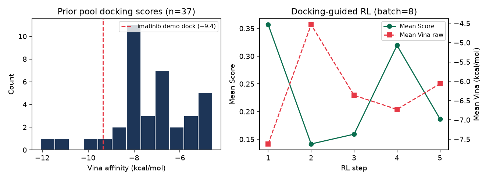
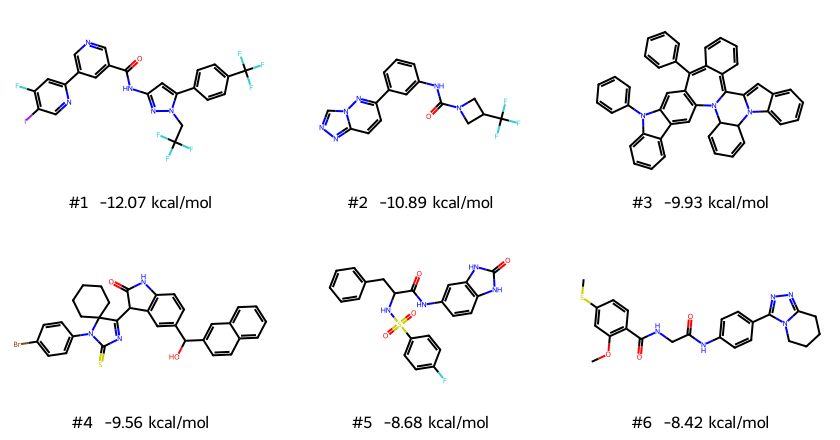

# REINVENT4 Tutorial 08: Docking-Guided Design

!!! abstract "Chapter 8 of the REINVENT4 course"
    Until now rewards were fast RDKit properties. This chapter puts a
    **structure-based oracle** into the generation loop: prepare a public pocket,
    wire **AutoDock Vina** through REINVENT’s `ExternalProcess` component, score
    a prior sample, run a short docking-guided RL job, and inspect poses. The
    unit is the *design loop* — not a Vina CLI manual. CPU, seed **42**,
    reproducible.

## Learning Objectives

After completing this chapter, you will be able to:

- [ ] Prepare one public pocket / cognate ligand with a documented protocol
      (PDB **1IEP**, Abl + STI / imatinib).
- [ ] Implement an `ExternalProcess` script that returns Vina affinities as JSON
      REINVENT can consume.
- [ ] Run `run_type = "scoring"` on a sampled pool and read Score vs raw docking.
- [ ] Launch a short `staged_learning` job with docking in `[stage.scoring]`.
- [ ] List when docking scores mislead (box, tautomer/protonation, exhaustiveness,
      pose plausibility).

## Why It Matters

A high QED molecule can sit nowhere near the pocket. Docking asks a different
question:

> *Does this pose make geometric sense in this binding site — under this
> protocol?*

Official docking sections teach engines. This Lab chapter teaches the
**REINVENT design loop**:

```text
pocket prep → scoring component → short generation → pose sanity check
```

DockStream / MAIZE are production wrappers (see official `SCORING.md`). Here we
use **Vina + ExternalProcess** so you can see every byte on the wire and run on
a laptop CPU.

!!! tip "What you'll have by the end of this chapter"
    From the seed-42 handbook run (exhaustiveness **1** for speed):

    | Artifact | Result |
    |----------|--------|
    | Prior pool | 37 unique SMILES docked |
    | Vina raw range | **−12.1 → −4.6** kcal/mol |
    | Imatinib demo dock (same box, exh=1) | **−9.4** kcal/mol |
    | Docking-guided RL | 5 steps × batch 8 (~123 s) |

    

!!! warning "Demo length ≠ production campaign"
    Exhaustiveness 1 and five RL steps are for teaching the loop. Production
    docking RL uses higher exhaustiveness, larger batches, diversity filters
    (Tutorial 05), and GPU/queue infrastructure (Tutorial 09).

## Hands-on Practice

### Prerequisites

- **Completed:** [Tutorial 03](03-scoring-function.md) — components, transforms,
  geometric mean.
- **Completed:** [Tutorial 04](04-reinforcement-learning.md) — `staged_learning`.
- **Tools:** REINVENT4 env; **AutoDock Vina** on `PATH`; Open Babel (`obabel`)
  for receptor prep; **meeko** + RDKit inside the REINVENT env for ligand PDBQT.
- **OS:** Linux validated (Ubuntu 22.04/24.04).
- **GPU:** *Not required.*

```bash
reinvent --version
vina --version
obabel -V | head -1
python -c "from meeko import MoleculePreparation; print('meeko OK')"
```

Install hints (Debian/Ubuntu):

```bash
sudo apt-get install -y autodock-vina openbabel
# inside reinvent4-env
pip install meeko gemmi
```

Cross-link: classic Vina usage also lives under
[Docking → AutoDock Vina](../../docking/autodock-vina.md) (Coming Soon outline).
This chapter only covers what the **generator** needs.

#### Why these design choices?

=== "Why ExternalProcess instead of DockStream / MAIZE?"

    DockStream is marked superseded; MAIZE is a full workflow stack. ExternalProcess
    is the generic JSON stdin/stdout contract — ideal for a transparent teaching
    oracle you can debug line by line.

=== "Why PDB 1IEP?"

    Public Abl–imatinib complex, easy cognate ligand (STI), well-known site. Swap
    later for your project PDB (Tutorial 11 will push a BRAF-style campaign).

=== "Why geometric mean of QED (0.3) + Vina (1.0)?"

    Pure docking rewards often invent large greasy binders. A light QED term
    keeps the demo closer to a multi-parameter design mindset without drowning
    the docking signal.

=== "Why exhaustiveness = 1 in the loop?"

    Each Vina call rebuilds a grid; exh=8×batch×steps is overnight on CPU. The
    chapter still redocks top hits at higher exhaustiveness for pose inspection.

### Step 1: Prepare the pocket (documented once)

Shipped assets (ready to use):

- [receptor.pdbqt](../../assets/reinvent4/08/pocket/receptor.pdbqt) — Abl chain A
- [box.txt](../../assets/reinvent4/08/pocket/box.txt) — center + size
- [ligand_sti_A.pdb](../../assets/reinvent4/08/pocket/ligand_sti_A.pdb) — cognate STI
- [pocket/PROTOCOL.txt](../../assets/reinvent4/08/pocket/PROTOCOL.txt) — rebuild notes

Protocol summary:

```bash
curl -L -o 1iep.pdb https://files.rcsb.org/download/1IEP.pdb
awk '/^ATOM/ && substr($0,22,1)=="A"' 1iep.pdb > receptor_A.pdb
obabel receptor_A.pdb -O receptor.pdbqt -xr
awk '/^HETATM/ && $4=="STI" && $5=="A"' 1iep.pdb > ligand_sti_A.pdb
# box.txt = ligand centroid + ~30 Å cube (see shipped file)
```

Handbook box:

```text
15.614 53.380 15.455 28.7 30.0 30.0
```

**Sanity check** — dock imatinib SMILES into the same box:

```text
Cc1ccc(NC(=O)c2ccc(CN3CCN(C)CC3)cc2)cc1Nc1nccc(-c2cccnc2)n1
```

Expect roughly **−9 to −12** kcal/mol depending on exhaustiveness (exh=1 ≈ −9.4;
exh=4 ≈ −12 in our prep).

### Step 2: ExternalProcess Vina script

Copy [vina_external.py](../../assets/reinvent4/08/scripts/vina_external.py) next
to a `pocket/` directory that contains `receptor.pdbqt` and `box.txt`.

Contract (from REINVENT `SCORING.md`):

- SMILES on **stdin** (one per line)
- JSON on **stdout**:
  `{"version": 1, "payload": {"vina_score": [...], "vina_ok": [...]}}`

Quick test:

```bash
printf '%s\n' 'CCO' 'c1ccccc1' | python vina_external.py
```

You should see JSON with two affinities. Failed embeds / docks return `0.0`
with `vina_ok = 0`.

Environment knobs: `VINA_EXHAUSTIVENESS` (default 1), `VINA_CPU`, `VINA_SEED`.

### Step 3: Score a prior pool (debug the oracle first)

Sample ~40 molecules, then `run_type = "scoring"` — same discipline as Tutorial 03
(debug reward before RL):

```toml
run_type = "scoring"
device = "cpu"
json_out_config = "_score_dock.json"

[parameters]
smiles_file = "pool.smi"
output_csv = "pool_docked.csv"

[scoring]
type = "geometric_mean"
parallel = 1

[[scoring.component]]
[scoring.component.QED]
[[scoring.component.QED.endpoint]]
name = "QED"
weight = 0.3

[[scoring.component]]
[scoring.component.ExternalProcess]
[[scoring.component.ExternalProcess.endpoint]]
name = "Vina"
weight = 1.0
params.executable = "/path/to/reinvent4-env/bin/python"
params.args = "/path/to/vina_external.py"
params.property = "vina_score"
transform.type = "reverse_sigmoid"
transform.high = -5.0
transform.low = -12.0
transform.k = 0.4
```

```bash
export VINA_EXHAUSTIVENESS=1 VINA_SEED=42
reinvent -l score_dock.log -s 42 score_dock.toml
```

Handbook run: **~199 s**, peak RAM **~0.75 GiB**, n = **37** after uniqueness.

Read columns `Vina (raw)`, `Vina` (transformed), `Score`, and metadata
`vina_ok (Vina)`.

Top pool molecules (raw docking):



Notice the tradeoff: the best raw dock (**−12.1**) can have **low QED**; a
slightly weaker dock with high QED can win the geometric mean. That is the design
loop talking — not a bug.

Snippet: [pool-docked-sample.csv](../../assets/reinvent4/08/pool-docked-sample.csv).

### Step 4: Short docking-guided RL

Nest the same scoring under `[stage.scoring]`:

```toml
run_type = "staged_learning"
device = "cpu"
json_out_config = "_rl_dock.json"

[parameters]
summary_csv_prefix = "rl_dock"
prior_file = "priors/reinvent_pubchem.prior"
agent_file = "priors/reinvent_pubchem.prior"
batch_size = 8
randomize_smiles = true

[learning_strategy]
type = "dap"
sigma = 128
rate = 0.0001

[[stage]]
chkpt_file = "rl_dock.chkpt"
termination = "simple"
max_score = 1.0
min_steps = 2
max_steps = 5

[stage.scoring]
type = "geometric_mean"
parallel = 1
# ... same QED + ExternalProcess.Vina block as Step 3 ...
```

```bash
reinvent -l rl_dock.log -s 42 rl_dock.toml
```

Handbook run: **~123 s**, peak RAM **~1.0 GiB**.

| Step | Mean Score | Mean Vina (raw) |
|-----:|-----------:|----------------:|
| 1 | 0.36 | −7.6 |
| 2 | 0.14 | −4.5 |
| 3 | 0.16 | −6.4 |
| 4 | 0.32 | −6.7 |
| 5 | 0.19 | −6.1 |

Five noisy steps do **not** prove optimization — and that is the lesson. Docking
oracles are slow and high-variance at exh=1; treat this CSV as proof the loop
runs, then scale steps / exhaustiveness / DF before claiming a hit series.

Snippet: [rl-dock-sample.csv](../../assets/reinvent4/08/rl-dock-sample.csv).

### Step 5: Pose sanity checks

Redock the best pool SMILES at higher exhaustiveness and open the PDBQT in PyMOL
/ ChimeraX with `receptor.pdbqt`:

| Rank | Vina (pool, exh=1) | Redock exh=4 | Note |
|-----:|-------------------:|-------------:|------|
| 1 | −12.07 | −12.07 | Strong score; still inspect clashes / strain |
| 2 | −10.89 | −10.93 | High QED companion |
| 3 | −9.93 | −9.93 | Large aromatic — check box artifacts |

Pose table: [top_poses.tsv](../../assets/reinvent4/08/top_poses.tsv).

**When docking scores mislead**

| Failure mode | What you see | What to do |
|--------------|--------------|------------|
| Wrong / oversized box | Everything scores “great” | Rebuild box from cognate ligand; ≤30 Å typical |
| Exhaustiveness too low | Rank order unstable across seeds | Raise exh for triage; keep exh=1 only for smoke tests |
| Wrong tautomer / charge | Cognate redock is poor | Fix ligand prep (meeko / protonation at pH) |
| Receptor missing side chains / wrong chain | Empty pocket or clashes | Use the biologically relevant chain/assembly |
| Scoring `0.0` floods | Embed or Vina failures | Check `vina_ok`; harden 3D embed; timeout |
| Optimizing score only | Huge greasy “binders” | Keep QED/MW/alerts; add DF (Tutorial 05) |

### Common Errors

??? failure "`ExternalProcess` JSON missing `payload` / property key"
    Print exactly one JSON object to stdout. No progress bars on stdout (log to
    stderr). `params.property` must match the payload key (`vina_score`).

??? failure "`ValidationError` on bare `[scoring]` inside staged learning"
    Use `[stage.scoring]` — same trap as Tutorial 04.

??? failure "Vina PDBQT parse errors from Open Babel ligands"
    Prefer **meeko** for ligands. Open Babel receptor `-xr` is fine for rigid
    protein PDBQT in this demo.

??? failure "RL appears to “work” but poses are nonsense"
    Affinity is not a pose validator. Always open top PDBQTs in the receptor.

??? failure "Wall-clock explodes"
    Cut `batch_size` / `max_steps`, keep exh=1 for the loop, cache nothing yet —
    or move docking to a queue (Tutorial 09).

## Code Walkthrough

| Parameter | Value | Meaning |
|-----------|-------|---------|
| `ExternalProcess.executable` | env `python` | Interpreter that can import RDKit/meeko |
| `ExternalProcess.args` | path to script | Script path only (SMILES come on stdin) |
| `ExternalProcess.property` | `vina_score` | Key inside JSON `payload` |
| `transform` | `reverse_sigmoid` −5 → −12 | More negative affinity → higher [0,1] score |
| `QED` weight | `0.3` | Light drug-likeness pressure |
| `batch_size` / `max_steps` | `8` / `5` | Smoke-test RL budget on CPU |

!!! note "Official docs vs this chapter"
    `SCORING.md` documents DockStream / MAIZE / ExternalProcess flags. This
    chapter owns the **pocket → component → pose review** workflow and the
    honesty bar for short docking RL.

## Expected Output

| File | Description |
|------|-------------|
| `pool_docked.csv` | Prior molecules + QED + Vina raw/transformed |
| `rl_dock_1.csv` | Docking-guided RL trajectories |
| `receptor.pdbqt` / `box.txt` | Structure oracle definition |
| Top PDBQT poses | For visual inspection |

Resources / wall-clock (this chapter’s machine):

| Stage | Wall-clock | Peak RAM |
|-------|------------|----------|
| Score pool (n≈37, exh=1) | ~199 s | ~0.75 GiB |
| RL 5×8 | ~123 s | ~1.0 GiB |

## Think About It

1. **Why debug docking with `run_type = "scoring"` before RL?** If the oracle is
   wrong, RL will confidently optimize the bug.
2. **Why can the best raw dock lose on Score?** Geometric mean with QED — a
   deliberate MPO conflict you should be able to explain.
3. **Does a rising Score over 5 steps prove better binders?** Not at exh=1 with
   batch 8. Prove with longer runs, pose review, and orthogonal assays.
4. **When would you TL (Tutorial 07) before docking RL?** When the prior rarely
   emits the chemotype that fits the pocket — docking cannot reward what is never
   sampled.

## Exercises

1. **Easy:** Redock the cognate imatinib SMILES at exh=1 and exh=8. How much does
   affinity move?
2. **Medium:** Change `transform.low` from −12 to −14 (stricter). Rescore the
   same `pool.smi`. Which molecules fall out of the top 5?
3. **Challenge:** Add a Murcko diversity filter (Tutorial 05) to a 25-step
   docking RL job. Report unique scaffolds in the last 5 steps vs no DF.

## Further Reading

- [REINVENT4 `configs/SCORING.md`](https://github.com/MolecularAI/REINVENT4/blob/main/configs/SCORING.md) — ExternalProcess / DockStream / MAIZE.
- [AutoDock Vina](https://github.com/ccsb-scripps/AutoDock-Vina) — docking engine.
- PDB [1IEP](https://www.rcsb.org/structure/1IEP) — Abl–STI complex.
- Loeffler et al., *REINVENT 4*, **J. Cheminformatics** (2024). [Open Access](https://doi.org/10.1186/s13321-024-00812-5).
- Handbook: [Tutorial 03 — Scoring](03-scoring-function.md),
  [Tutorial 07 — Transfer Learning](07-transfer-learning.md),
  [Docking index](../../docking/index.md).

---

**Next chapter:** [Tutorial 09 — Scaling & Monitoring](09-scaling-and-monitoring.md),
where GPU runs, logs, and TensorBoard support longer campaigns (including expensive
oracles like docking).
