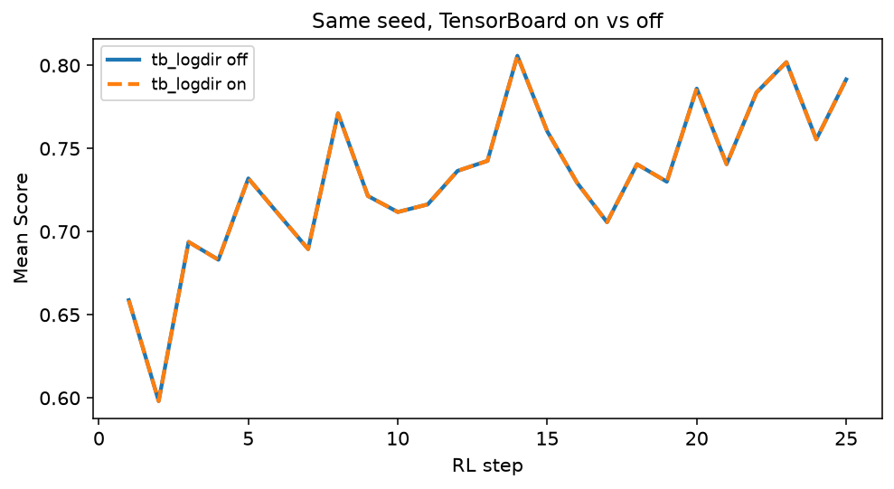
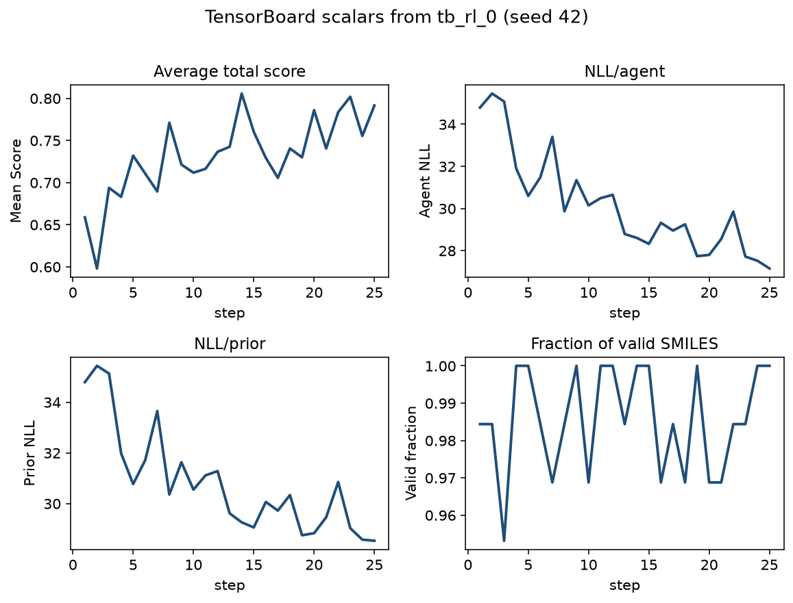
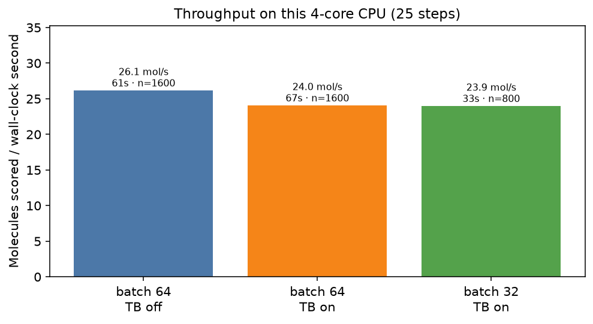
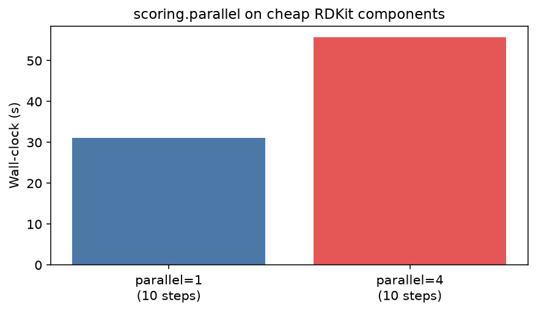

# REINVENT4 Tutorial 09: Scaling & Monitoring

!!! abstract "Chapter 9 of the REINVENT4 course"
    Tutorial 04 proved that a 25-step CPU RL run can raise Score. This chapter
    treats the **same protocol** as a campaign you would actually watch: enable
    TensorBoard, measure wall-clock and throughput, and know which traces tell
    you to stop or continue. A GPU is the intended scale-up — this host did not
    have one, so the GPU path is a one-line TOML change plus the real error you
    get from a CPU-only wheel. Everything else ran with seed **42**.

## Learning Objectives

After completing this chapter, you will be able to:

- [ ] Re-run the Tutorial 04 `staged_learning` config as a **monitored** job
      (`tb_logdir`) and confirm that TensorBoard does not change the chemistry
      at a fixed seed.
- [ ] Name the TensorBoard traces you use to **stop or continue** a campaign.
- [ ] Report wall-clock, peak RAM, and **molecules per second** when you change
      `batch_size` (not just “it felt faster”).
- [ ] Switch `device` to `"cuda:0"` when you have a CUDA build — and recognize
      the failure mode of a CPU-only PyTorch wheel.
- [ ] Decide whether `scoring.parallel` is worth turning on for *this*
      cheap RDKit stack (here: it is not).

## Why It Matters

A 25-step notebook run is a unit test of the RL loop. A real campaign is
hundreds of steps, an expensive oracle (Tutorial 08 docking), or both. Without
instrumentation you cannot tell a noisy batch from a dead scoring function, and
without a throughput number you cannot budget GPU time.

Official docs list `tb_logdir` and `device` in
[`PARAMS.md`](https://github.com/MolecularAI/REINVENT4/blob/main/configs/PARAMS.md).
This lab answers the campaign questions:

> *Did GPU (or a bigger batch) change the result, or only the clock?*
> *Which curve do I actually look at before I spend another night of sampling?*

!!! tip "What you'll have by the end of this chapter"
    On a 4-core Xeon CPU, REINVENT **4.8.24**, seed **42**, Tutorial 04 scoring:

    | Arm | Wall-clock | Peak RAM | Molecules | mol/s | Score 1 → 25 |
    |-----|------------|----------|-----------|-------|----------------|
    | `tb_logdir` off | **61.2 s** | 1.51 GiB | 1600 | 26.1 | 0.66 → 0.79 |
    | `tb_logdir` on | **66.6 s** | 1.51 GiB | 1600 | 24.0 | 0.66 → 0.79 |
    | `batch_size = 32` | **33.4 s** | 1.23 GiB | 800 | 23.9 | noisier @25 |

    TensorBoard on vs off is the **same chemistry** (step-1 SMILES identical;
    max mean-Score difference **0.0**). The extra ~5 s is logging.

    

## Hands-on Practice

### Prerequisites

- **Completed:** [Tutorial 04](04-reinforcement-learning.md) — you already trust
  this scoring function and the 25-step DAP setup.
- **OS:** Linux (Ubuntu 22.04/24.04 validated).
- **Python / env:** the same `reinvent4` / `reinvent4-env` from Tutorial 01.
- **GPU:** *Optional.* This recording host had **no** `nvidia-smi` and a
  **CPU** PyTorch wheel (`2.12.0+cpu`). The GPU TOML is still the scale-up you
  want on a workstation; see Step 5.
- **Tools:** `reinvent` CLI; TensorBoard comes with REINVENT4 (`tensorboard<3`).

```bash
reinvent --version
python -c "import torch; print(torch.__version__, torch.cuda.is_available())"
```

```text
REINVENT 4.8.24 (C) AstraZeneca 2017, 2023 using PyTorch 2.12.0+cpu.
2.12.0+cpu False
```

#### Why these design choices? (read before scaling)

=== "Why reuse Tutorial 04 instead of a new protocol?"

    Throughput numbers are meaningless if the scoring function changed. The
    campaign question is: *same science, different computer / logger / batch.*
    Tutorial 04 already published Score 0.66 → 0.79 and Agent NLL 34.79 → 27.15
    at seed 42. This chapter must match those chemistry numbers on a new host
    (wall-clock will differ).

=== "Why TensorBoard rather than only the CSV?"

    `staged_learning_1.csv` is the archival record. TensorBoard is the
    *live* instrument: component traces, NLL panel, validity, and (optional)
    structure grids. You stop a run from the live traces; you publish from the
    CSV.

=== "Why not a CUDA install tutorial?"

    Driver / toolkit / wheel matching belongs in
    [Getting Started — CUDA](../../getting-started/cuda.md). Here the unit is
    the **RL job**: one `device` key, one measured clock, one failure mode.

### Step 1: Control — Tutorial 04 RL with logging off

Save [rl-tb-off.toml](../../assets/reinvent4/09/rl-tb-off.toml) (no `tb_logdir`).
This is Tutorial 04's config with renamed outputs:

```bash
reinvent -l tb_off.log -s 42 rl-tb-off.toml
```

On this 4-core host: **61.2 s**, peak RAM **~1.51 GiB**, Score **0.66 → 0.79**,
Agent NLL **34.79 → 27.15**. Same chemistry as Tutorial 04; slower wall-clock
than that chapter's ~27 s because the *machine* changed, not the protocol.

### Step 2: Treatment — enable TensorBoard

Copy the file to [rl-tb.toml](../../assets/reinvent4/09/rl-tb.toml) and add one
top-level key:

```toml
tb_logdir = "tb_rl"
```

Keep `device`, `batch_size`, DAP, scoring, `max_steps`, and the seed identical.

```bash
reinvent -l tb_on.log -s 42 rl-tb.toml
```

**Result:** Score / NLL / step-1 SMILES match the control exactly. Wall-clock
**66.6 s** (+5.4 s, +9%). REINVENT writes the events under `tb_rl_0/` — staged
learning appends `_{run}` (here `0`). Look there, not in a bare `tb_rl/` folder.

```bash
tensorboard --logdir tb_rl_0 --port 6006
```

Open `http://127.0.0.1:6006`. The scalars that matter for a stop/continue call
are below (exported from this run's event file):



**Which traces to watch**

| Trace | Use it to… |
|-------|------------|
| `Average total score` | Primary objective. Continue while it trends up; stop after a long plateau. |
| `NLL/agent` vs `NLL/prior` | DAP health. Agent NLL should fall; prior NLL stays an anchor. A collapse in validity plus a crashing agent NLL is overfit, not success. |
| `Fraction of valid SMILES` | Hard stop if this falls off a cliff. |
| `QED` / `MW` (and `(raw)`) | Which *component* is stuck. A rising Score with flat QED means MW/alerts are doing the work. |
| `Loss` | Optimizer sanity; not a chemistry decision by itself. |
| `Number of unique scaffolds` | Only present with a diversity filter (Tutorial 05). |

Do **not** stop on a single noisy step — Tutorial 04 already showed batch-level
jitter. Do **not** continue just because Loss is still decreasing if validity
is dying.

### Step 3: Throughput — `batch_size` 64 vs 32

Same seed, same 25 steps, `tb_logdir` on, only `batch_size = 32`
([rl-bs32.toml](../../assets/reinvent4/09/rl-bs32.toml)):

| | batch 64 | batch 32 |
|--|----------|----------|
| Molecules (25 steps) | 1600 | 800 |
| Wall-clock | 66.6 s | **33.4 s** |
| Peak RAM | 1.51 GiB | **1.23 GiB** |
| Throughput | 24.0 mol/s | 23.9 mol/s |
| Mean Score @25 | **0.79** | 0.66 (last batch noisy) |

Halving the batch almost halves wall-clock because you did **half the work**.
Per-molecule throughput barely moved. RAM dropped ~0.3 GiB. The last-step Score
is a noisier estimator at 32 molecules/step — do not call that “worse RL”
without looking at the whole curve.



### Step 4: `scoring.parallel` — only if it helps *this* protocol

`[stage.scoring] parallel = N` farms **component** evaluation across processes
(max 40). For QED + MW + alerts, raising `parallel` from 1 to 4 on a **10-step**
probe made the job **slower** (31.0 s → 55.7 s): process overhead dominates
cheap RDKit calls.



Leave `parallel = 1` for this stack. Turn it on when the oracle is expensive
(Tutorial 08 Vina, a QSAR endpoint, a REST model) and you have measured a gain.

There is no separate “parallel sampling” switch on Reinvent RNN RL. Do not
confuse `scoring.parallel` with Data Pipeline `num_procs` (a different run
mode). Short note: [Tutorial 12](12-troubleshooting-appendix.md).

### Step 5: GPU — the one-line scale-up (and a real failure)

On a machine with a CUDA PyTorch wheel and a visible GPU, the only protocol
change is:

```toml
device = "cuda:0"   # was "cpu"
```

Downloadable: [rl-cuda.toml](../../assets/reinvent4/09/rl-cuda.toml).

This recording host failed immediately:

```text
AssertionError: Torch not compiled with CUDA enabled
```

That is a **CPU wheel** (`install.py cpu` / `2.12.0+cpu`), not a missing
`CUDA_VISIBLE_DEVICES` tweak. Fix: reinstall with the CUDA installer from
Tutorial 01 (`python install.py cu124` or the tag that matches your driver),
then `python -c "import torch; print(torch.cuda.is_available())"` must print
`True` before you trust `device = "cuda:0"`.

If you *do* have a GPU, re-run Step 2 at the same seed and report:

1. Wall-clock vs the CPU number in this chapter (or vs your own CPU control).
2. Whether mean Score vs step overlays. Small float differences are normal;
   a different *shape* means the job is not the same protocol.

### Common Errors

??? failure "`AssertionError: Torch not compiled with CUDA enabled`"
    You set `device = "cuda:0"` (or `-d cuda:0`) on a CPU-only PyTorch build.
    Check `torch.__version__` for a `+cpu` suffix. Reinstall CUDA wheels; do
    not expect `device` alone to download CUDA.

??? failure "`RuntimeError: CUDA out of memory`"
    Batch too large for the card. Lower `batch_size` (Step 3) or use a smaller
    model. Tutorial 01 also covers this for sampling.

??? failure "TensorBoard shows an empty project / no scalars"
    Staged learning writes `tb_logdir_{run}/` (`tb_rl_0` here). Point
    `--logdir` at that folder (or its parent). An empty string `tb_logdir`
    disables logging entirely.

??? failure "TB-on and TB-off chemistry disagree at seed 42"
    The TOMLs drifted (batch, sigma, scoring, prior path) or you changed `-s`.
    Diff the configs; only `tb_logdir` and output names should differ.

??? failure "Job is slower after `scoring.parallel = 4`"
    Expected for cheap RDKit components on a small batch (Step 4). Measure
    before leaving it on.

## Code Walkthrough

Top-level keys that turn a Tutorial 04 job into a campaign job:

| Parameter | Value | Meaning |
|-----------|-------|---------|
| `tb_logdir` | `"tb_rl"` | TensorBoard directory *prefix*; actual events land in `tb_rl_0`. Omit or `""` to disable. |
| `device` | `"cpu"` / `"cuda:0"` | PyTorch device. Must match the wheel + hardware. |
| `batch_size` | `64` (control) | Molecules sampled and scored per step. Throughput knob, not a free accuracy upgrade. |
| `scoring.parallel` | `1` | CPU processes for scoring components. Leave at 1 unless the oracle is slow. |
| `tb_isim` | default `false` | Optional iSIM trace in TensorBoard; skip until you need it. |

CSV snippet from the TB-on run
([tb-on-sample.csv](../../assets/reinvent4/09/tb-on-sample.csv)):

```text
step,SMILES,Score,QED,MW,Alerts,Agent,Prior,Target
1,NC(=O)C(CCOCc1ccccc1)c1ccccc1,0.8857,0.7857,0.9983,1.0000,24.4089,24.4089,88.9566
1,CC(C)(C)CN1COCC1CN,0.2190,0.6644,0.0722,1.0000,25.8254,25.8254,2.2028
25,CN(CC(=O)NCC(F)(F)F)CC(C)(C)O,0.8469,0.7320,0.9800,1.0000,21.9730,24.5670,83.8402
```

Full parameter catalogue:
[`configs/PARAMS.md`](https://github.com/MolecularAI/REINVENT4/blob/main/configs/PARAMS.md)
(top-level keys + staged learning). This chapter does not restate that table.

## Expected Output

| File | What it proves |
|------|----------------|
| `tb_on_1.csv` / `tb_off_1.csv` | Same Score curve as Tutorial 04 at seed 42 |
| `tb_rl_0/` | Event files TensorBoard actually reads |
| `tb_on.chkpt` | Resume point (`agent_file`) for a longer campaign |
| time / RSS | Host-specific clock; chemistry is the portable result |

How to read the campaign:

1. **Chemistry matched** — TB on/off overlays; NLL 34.79 → 27.15 as in Tutorial 04.
2. **Logging is cheap** — +9% wall-clock on CPU for this short run. On a GPU
   night-long docking campaign the relative cost is smaller; leave it on.
3. **Batch size is work, not magic** — 32 vs 64 did not improve mol/s here.
4. **GPU is a rebuild + one key** — until `torch.cuda.is_available()` is true,
   `device = "cuda:0"` is an error, not a speedup.

## Think About It

1. **Why can wall-clock differ from Tutorial 04 (~27 s vs ~61 s) while Score
   matches to two decimals?** The protocol and seed are portable; the host is
   not. Always publish both.
2. **If `Average total score` is flat but `QED (raw)` is still rising, what is
   the geometric mean hiding?** Another component (MW or alerts) is capping the
   product. Read the component traces before you “turn up sigma”.
3. **Why did batch 32 look worse at step 25?** Variance. 32 molecules is a
   noisier mean than 64. Look at the curve, or increase `max_steps` at the same
   *molecule budget* (50×32 vs 25×64).
4. **Would you enable `scoring.parallel` for Tutorial 08 docking?** Yes, if a
   probe run shows Vina wall-clock dropping. The measurement from *this*
   RDKit-only protocol does not transfer.
5. **If GPU Score vs step diverges from CPU at the same seed, what do you
   check first?** Identical TOML except `device`, identical prior file, and
   that you did not enable TF32/different cudnn settings on purpose.

## Exercises

1. **Easy:** Launch TensorBoard on `tb_rl_0` and screenshot the NLL panel.
   Mark the step where Agent NLL has dropped ~5 units.
2. **Medium:** Re-run batch 64 for `max_steps = 50` with `tb_logdir` on. Using
   only the Score and validity traces, write a one-sentence stop/continue
   decision at step 25 *as if you had not seen step 50 yet*. Then look at 50.
3. **Challenge:** On a CUDA host, run the GPU TOML at seed 42 and overlay
   mean Score against this chapter's CPU CSV. Report wall-clock ratio and the
   maximum per-step Score gap. If you cannot get a GPU, record
   `torch.cuda.is_available()` and the exact exception — that is still a valid
   lab note.

## Further Reading

- [REINVENT4 `configs/PARAMS.md`](https://github.com/MolecularAI/REINVENT4/blob/main/configs/PARAMS.md) — `tb_logdir`, `device`, staged-learning batch size. Use when you need the default list, not a measured campaign.
- [TensorBoard](https://www.tensorflow.org/tensorboard) — UI for the event files this chapter writes.
- Loeffler et al., *REINVENT 4: Modern AI-driven generative molecule design*, **J. Cheminformatics** (2024). [Open Access](https://doi.org/10.1186/s13321-024-00812-5).
- Handbook: [Tutorial 04 — RL](04-reinforcement-learning.md), [Tutorial 08 — Docking](08-docking-guided-design.md) (expensive oracle), [Tutorial 10 — Ablations](10-ablations-and-hyperparameters.md).

---

**Next chapter:** [Tutorial 10 — Ablations & Hyperparameters](10-ablations-and-hyperparameters.md),
where `sigma` is changed one value at a time and the table is yours, not PARAMS.md.
