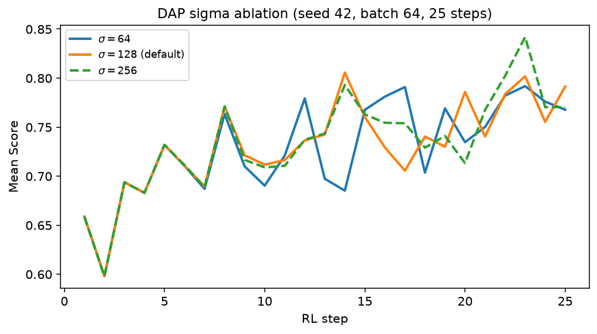
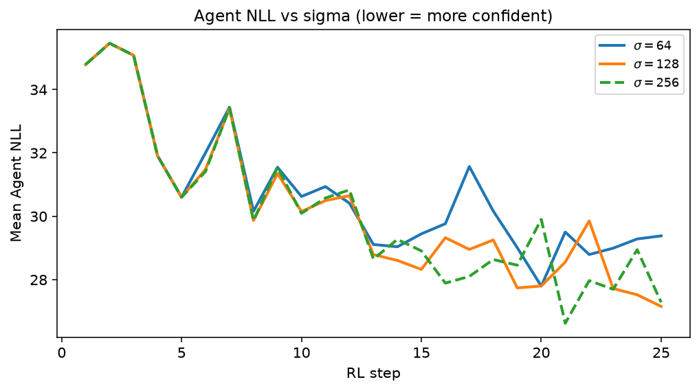
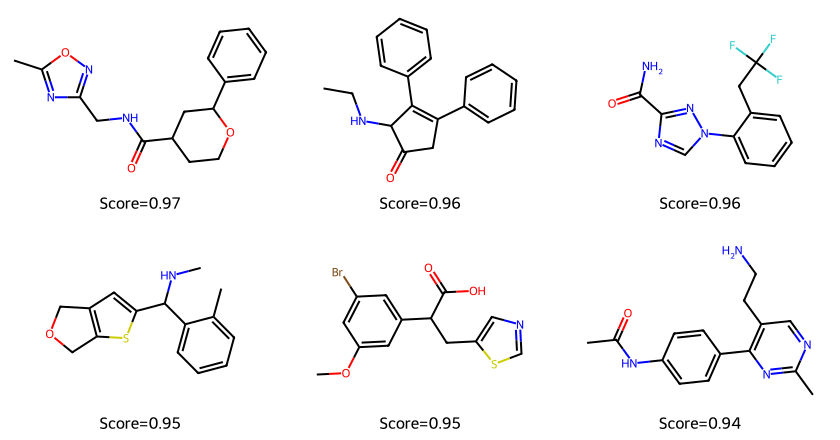
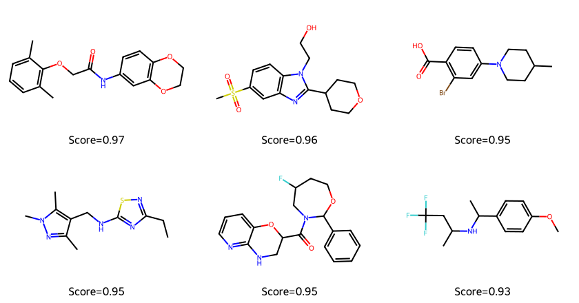
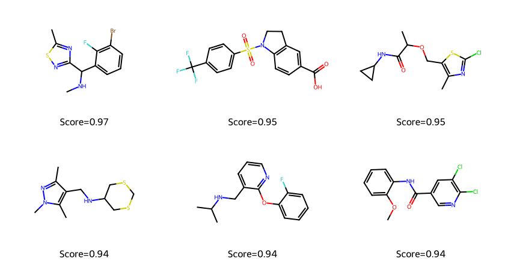
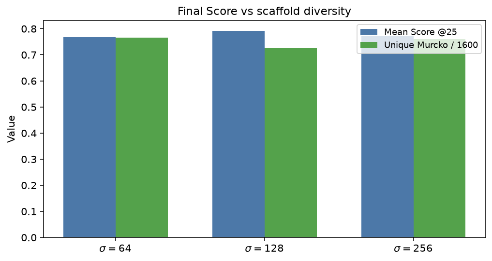

# REINVENT4 Tutorial 10: Ablations & Hyperparameters

!!! abstract "Chapter 10 of the REINVENT4 course"
    Tutorial 04 and 09 used DAP `sigma = 128` because it is REINVENT's default.
    This chapter treats that choice as an **experiment**: three values of
    `sigma` (64 / 128 / 256), one variable at a time, same seed, same scoring
    function, same 25×64 molecule budget. You publish *your* table — mean Score,
    last-step validity, unique Murcko scaffolds — and pick a default for
    learners. Not a restatement of PARAMS.md.

## Learning Objectives

After completing this chapter, you will be able to:

- [ ] Define a **base** RL config (Tutorial 04) and ablate **one** knob.
- [ ] Run ≥3 values of `sigma` at fixed seed and fixed step/batch budget.
- [ ] Tabulate mean Score, validity, unique scaffolds, and Agent NLL.
- [ ] Recommend a default for this prior + scoring stack, with the failure
      mode of the values you reject.
- [ ] State what you would **not** tune next (and why).

## Why It Matters

Hyperparameter folklore is cheap: “turn up sigma,” “bigger batch,” “more
steps.” Drug-discovery RL is a stochastic sampler glued to a brittle reward.
If you change two knobs at once you cannot say which one moved Score, and if
you only report the default you have not done an ablation.

`sigma` scales how strongly the Score reshapes the DAP target (Tutorial 04).
Too small and RL crawls; too large and the agent can overfit the reward and
nibble validity. That is a **measurable** claim. This chapter measures it.

!!! tip "What you'll have by the end of this chapter"
    Seed **42**, Tutorial 04 scoring, `batch_size = 64`, `max_steps = 25`,
    CPU, REINVENT **4.8.24**:

    | `sigma` | Score 1 → 25 | Agent NLL @25 | Valid @25 (log) | Unique Murcko / 1600 | Wall-clock |
    |---------|----------------|---------------|-----------------|----------------------|------------|
    | 64 | 0.66 → **0.77** | 29.38 | 100% | **1225** | 61.7 s |
    | **128** (default) | 0.66 → **0.79** | **27.15** | 100% | 1164 | 66.6 s |
    | 256 | 0.66 → **0.77** | 27.28 | **98%** | 1216 | 62.4 s |

    Recommendation for this stack: **keep `sigma = 128`.** It won final Score
    and moved the policy furthest (lowest Agent NLL) without a validity dip.

    

## Hands-on Practice

### Prerequisites

- **Completed:** [Tutorial 04](04-reinforcement-learning.md) and
  [Tutorial 09](09-scaling-and-monitoring.md) (optional but useful — TensorBoard
  overlays make the three runs comparable live).
- **OS / env / prior:** Tutorial 01; `priors/reinvent_pubchem.prior`.
- **GPU:** not required. Same CPU protocol as Tutorial 04.
- **Budget:** three 25-step jobs ≈ 3 × 1 minute on this 4-core host.

```bash
reinvent --version
test -f priors/reinvent_pubchem.prior && echo "prior OK"
```

#### Why these design choices? (read before the grid)

=== "Why `sigma` and not `rate` or `batch_size`?"

    Tutorial 04 already asked you to guess what a tiny vs huge `sigma` would
    do. This chapter answers that question with data. `rate` (Adam) needs
    several seeds before a 2× change is distinguishable from batch noise at
    25 steps. `batch_size` is a throughput knob (Tutorial 09), not a reward
    scale. Ablate `sigma` first.

=== "Why only three values, one seed?"

    A publication grid would add seeds (e.g. 42 / 7 / 123) and maybe `sigma`
    32 and 512. A teaching ablation must be **rerunnable this afternoon**.
    Three points around the official default, one seed, is enough to reject
    “bigger is always better” and to pick a learner default. Call out the
    single-seed limit in the write-up — that *is* the scientific practice.

=== "Why freeze steps and batch?"

    Otherwise you accidentally ablate *molecule budget*. 25 × 64 = 1600 scored
    molecules for every arm. The only line that changes is
    `[learning_strategy] sigma`.

### Step 1: Freeze the base config

Start from Tutorial 04's `rl.toml`. The `sigma = 128` arm is also Tutorial 09's
TensorBoard-on job ([rl-sigma128.toml](../../assets/reinvent4/10/rl-sigma128.toml)).

Confirm the base:

- `run_type = "staged_learning"`, `device = "cpu"`
- DAP `rate = 0.0001`
- QED + MW `double_sigmoid` 200–500 + CustomAlerts
- `max_steps = 25`, `batch_size = 64`
- **no** `[diversity_filter]` (that is Tutorial 05's variable)

### Step 2: Change only `sigma`

Write two copies:

- [rl-sigma64.toml](../../assets/reinvent4/10/rl-sigma64.toml) — `sigma = 64`
- [rl-sigma256.toml](../../assets/reinvent4/10/rl-sigma256.toml) — `sigma = 256`

Rename `summary_csv_prefix` / `chkpt_file` so outputs do not clobber.

```bash
reinvent -l sigma64.log  -s 42 rl-sigma64.toml
reinvent -l sigma128.log -s 42 rl-sigma128.toml
reinvent -l sigma256.log -s 42 rl-sigma256.toml
```

All three logs should print the **same** step-1 line if the seed and scoring
match:

```text
Score: 0.66 Agent NLL: 34.79 Valid:  98% Step: 1
```

If step 1 disagrees, the ablation is invalid — stop and diff the TOMLs.

### Step 3: Tabulate Score, validity, scaffolds

```bash
python - <<'PY'
import csv, statistics as st
from collections import Counter
from pathlib import Path
from rdkit import Chem
from rdkit.Chem.Scaffolds import MurckoScaffold

def murcko(smi):
    m = Chem.MolFromSmiles(smi)
    if not m:
        return None
    try:
        return MurckoScaffold.MurckoScaffoldSmiles(mol=m)
    except Exception:
        return None

def summarize(path, last=25):
    rows = list(csv.DictReader(open(path)))
    def mean_at(step, col):
        xs = [float(r[col]) for r in rows if int(r["step"]) == step]
        return st.mean(xs)
    scafs = [murcko(r["SMILES"]) for r in rows]
    scafs = [s for s in scafs if s]
    top = Counter(scafs).most_common(1)[0]
    print(path)
    print(f"  Score 1→{last}: {mean_at(1,'Score'):.2f} → {mean_at(last,'Score'):.2f}")
    print(f"  Agent NLL @{last}: {mean_at(last,'Agent'):.2f}")
    print(f"  unique Murcko: {len(set(scafs))}  top {top}")

for p in ["sigma64_1.csv", "sigma128_1.csv", "sigma256_1.csv"]:
    summarize(p)
PY
```

Read last-step **Valid:** from the log (REINVENT's own fraction), not only
RDKit over the CSV. In this run: 100% / 100% / **98%** at step 25.

### Common Errors

??? failure "Step-1 Score differs across arms"
    Seed, prior path, scoring block, or `batch_size` drifted. The ablation
    contract is: step 1 is the same stochastic batch; only later steps may
    diverge.

??? failure "`ValidationError` Extra inputs / missing `[stage.scoring]`"
    Copy-paste from Tutorial 03's top-level `[scoring]`. Nested stage keys
    only (Tutorial 04).

??? failure "Declaring a winner from step 25 alone"
    `sigma = 256` can look fine on Score and still show a validity nick.
    Report the pair (Score, Valid) plus unique scaffolds.

??? failure "Ablating sigma and batch size in the same grid"
    That is two questions. Finish this table first. Tutorial 09 already
    measured batch 32 vs 64 as a *throughput* experiment.

## Code Walkthrough

The only scientific line that changes:

```toml
[learning_strategy]
type = "dap"
sigma = 128    # ablate: 64 | 128 | 256
rate = 0.0001  # frozen
```

| Parameter | Role in this ablation |
|-----------|------------------------|
| `sigma` | Scales Score inside the DAP target. **The factor.** |
| `rate` | Adam step size. Frozen — not identifiable at 25 steps / 1 seed. |
| `batch_size` | Frozen at 64 so molecule budget is identical. |
| `max_steps` | Frozen at 25. Extending steps is a *new* experiment (Exercises). |



High-Score examples at step 25 (not “better drugs” — better on *this* QED+MW
reward):







CSV snippets:
[sigma64](../../assets/reinvent4/10/sigma64-sample.csv),
[sigma128](../../assets/reinvent4/10/sigma128-sample.csv),
[sigma256](../../assets/reinvent4/10/sigma256-sample.csv).

## Expected Output

**Winner for learners: `sigma = 128`.**

| Observation | Interpretation |
|-------------|----------------|
| All arms share Score 0.66 / NLL 34.79 at step 1 | Ablation is clean |
| `sigma = 128` highest Score @25 (0.79) and lowest Agent NLL (27.15) | Default is not folklore here — it worked |
| `sigma = 64` more unique Murcko (1225 vs 1164) but weaker NLL drop | Gentler RL ≈ more diversity, less optimization |
| `sigma = 256` no Score gain vs 128; Valid 98% at step 25 | “Turn it up” failed; first validity nick |



**What we would *not* tune next (and why)**

| Knob | Why not (yet) |
|------|----------------|
| `rate` | At 25 steps a 2× change is inside batch noise unless you add seeds. |
| `batch_size` jointly with `sigma` | Confounds molecule budget with reward scale (see Tutorial 09). |
| `inception` / new scoring terms | That is a new scientific question, not a hyperparameter of this reward. |
| `max_steps` as a “hyperparameter” without a stop rule | Use TensorBoard (Tutorial 09) to decide length; don't grid overnight jobs blindly. |

A multi-seed repeat (exercise) is the correct next *statistics* step, not a
new knob.

## Think About It

1. **Why must step 1 match across arms?** If it doesn't, you are not looking
   at `sigma` — you are looking at a different random batch or a different
   reward.
2. **`sigma = 64` has more unique scaffolds. Is that “better”?** Only if
   chemistry asked for breadth. This scoring function asked for QED+MW. Higher
   diversity with lower Score is the expected gentle-RL trade-off (see also
   Tutorial 05).
3. **Why isn't `sigma = 256` the strongest optimizer?** DAP already uses a
   large default. Past a point you buy noise and validity hits, not Score.
4. **Would you publish this table with n=1 seed?** As a teaching result, yes,
   with the limit stated. As a methods claim in a paper, no — add seeds.
5. **If validity had crashed at `sigma = 256`, what would you do before
   changing `rate`?** Lower `sigma` back toward 128, or inspect the molecules
   that went invalid — don't stack unmeasured knobs.

## Exercises

1. **Easy:** Plot mean Score vs step from the three CSVs (the figure in this
   chapter is the answer key). Circle the first step where `sigma = 128`
   stays above `sigma = 64` for five consecutive steps.
2. **Medium:** Repeat `sigma = 128` vs `256` at seed **7** (one extra pair).
   Does 256 still fail to beat 128 on Score@25? Write two sentences: what
   replicated, what did not.
3. **Challenge:** Keep `sigma = 128` and ablate `max_steps` ∈ {25, 50, 100}
   at seed 42. Using Tutorial 09 traces, mark a stop step *before* you look at
   the final Score. Then compare. This is a stopping-rule experiment, not a
   hunt for the maximum of a noisy curve.

## Further Reading

- [REINVENT4 `configs/PARAMS.md`](https://github.com/MolecularAI/REINVENT4/blob/main/configs/PARAMS.md) — learning strategy defaults (`sigma = 128`, `rate = 1e-4`). Use when you need the factory numbers; this chapter is the measured table around them.
- Loeffler et al., *REINVENT 4*, **J. Cheminformatics** (2024). [Open Access](https://doi.org/10.1186/s13321-024-00812-5).
- Blaschke et al., *REINVENT 2.0*, **J. Cheminformatics** (2020) — DAP / scoring context.
- Handbook: [Tutorial 04](04-reinforcement-learning.md), [Tutorial 05](05-diversity-filter.md) (diversity as a *separate* variable), [Tutorial 09](09-scaling-and-monitoring.md).

---

**Next chapter:** [Tutorial 11 — Case Study: BRAF](11-case-study-braf.md),
where the reward is no longer generic QED but a documented ligand-likeness
oracle on a real target story.
