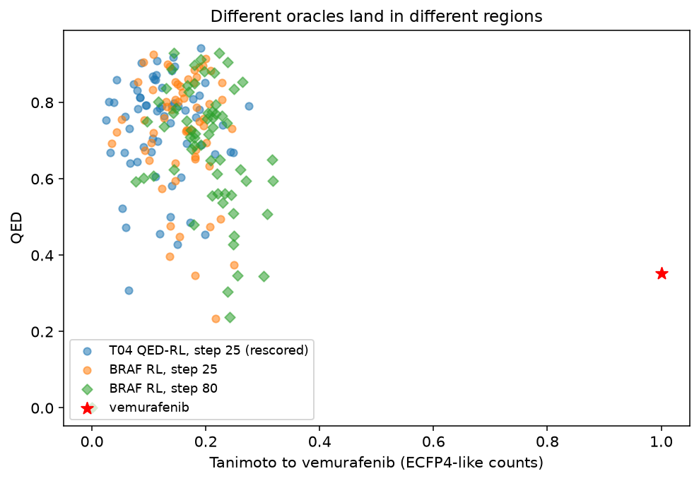
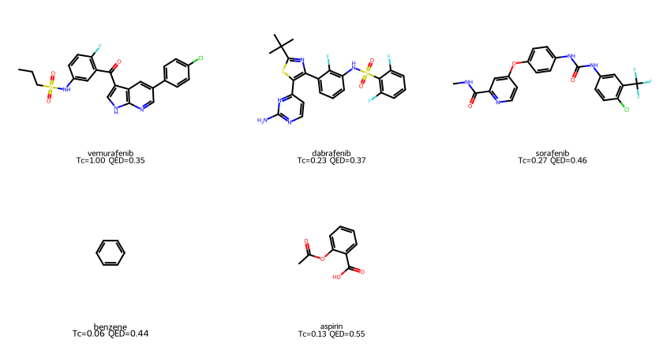
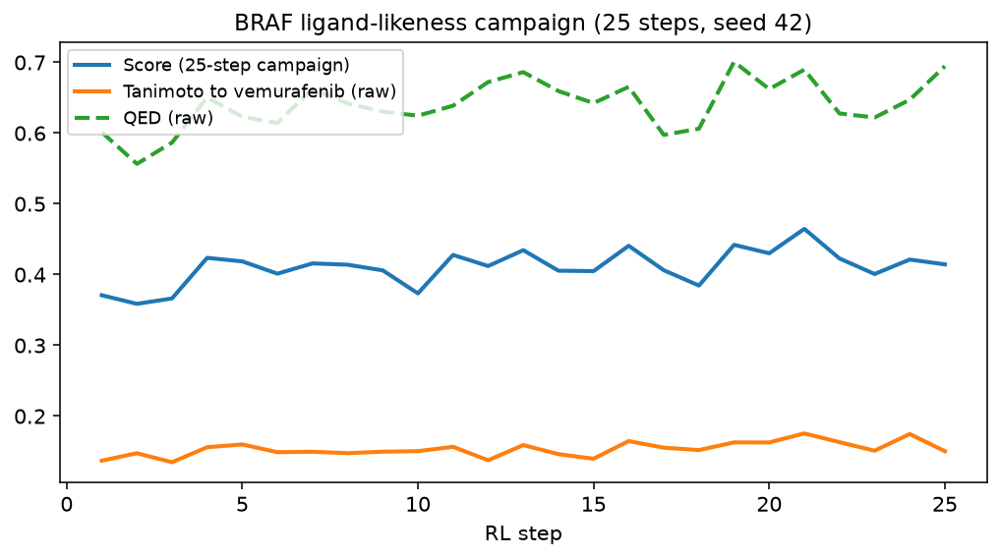
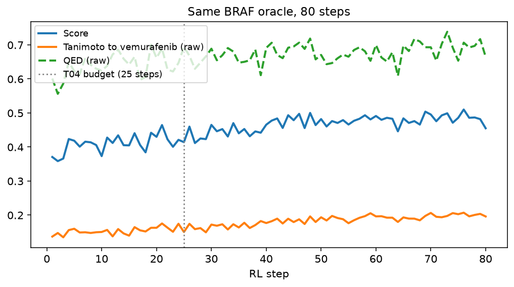
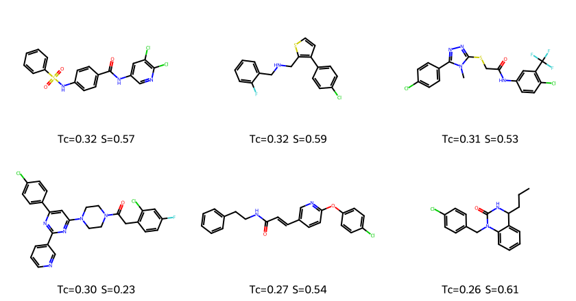
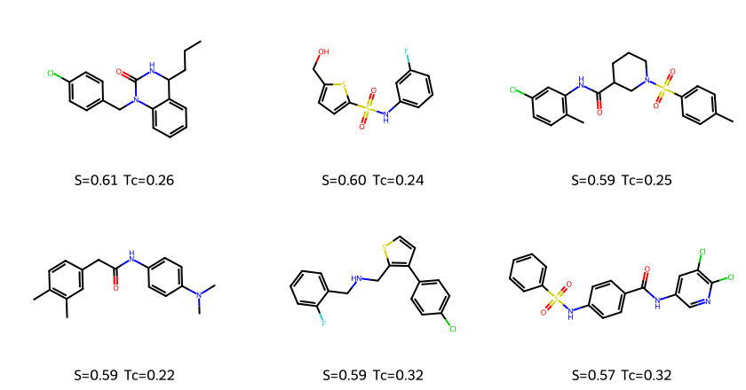

# REINVENT4 Tutorial 11: Case Study: BRAF

!!! abstract "Chapter 11 of the REINVENT4 course"
    The course so far optimized **generic** drug-likeness. This chapter is a
    documented **campaign** on a BRAF-inhibitor story: a scientific question,
    an oracle you can defend, success criteria written *before* looking at
    generated molecules, then prior → score → RL (+ diversity filter) at fixed
    seeds. The result is not a miracle analog of vemurafenib. It is a
    cite-able, rerunnable account of what ligand-likeness RL actually does —
    and what you would still send back to chemistry as “not ready.”

## Learning Objectives

After completing this chapter, you will be able to:

- [ ] State a BRAF-style **scientific question**, the **oracle** (and what it
      is *not*), and **success criteria** before generating molecules.
- [ ] Build a `TanimotoSimilarity` scoring function to a marketed reference
      (vemurafenib) plus the Tutorial 03 physchem stack.
- [ ] Sanity-check that oracle on known drugs and decoys, then on Tutorial 04
      QED-RL molecules (the control).
- [ ] Run RL + Murcko diversity filter at seed 42 for a T04-matched budget
      (25 steps) and a longer campaign (80 steps).
- [ ] Brief chemistry on what to look at next — and name what the model still
      gets wrong.

## Why It Matters

A handbook that stops at QED has not designed a kinase inhibitor. A blog that
shows pretty structures without a protocol cannot be cited. BRAF is the
climax because the chemistry is famous (vemurafenib / PLX4032; dabrafenib;
sorafenib) and the failure modes are obvious:

- Fingerprint similarity is **not** potency.
- The marketed drug itself can **lose** a QED contest.
- 25 CPU steps that crushed generic QED barely move Tanimoto.
- Without a control (QED-only RL), every “BRAF-like” molecule is anecdotal.

Official docs describe `TanimotoSimilarity` in
[`SCORING.md`](https://github.com/MolecularAI/REINVENT4/blob/main/configs/SCORING.md).
This lab runs the campaign.

!!! tip "What you'll have by the end of this chapter"
    Protocol: [PROTOCOL.txt](../../assets/reinvent4/11/PROTOCOL.txt).
    Seed **42**, REINVENT **4.8.24**, CPU.

    | Check | Result |
    |-------|--------|
    | Vemurafenib Tanimoto | **1.00** (sanity) |
    | Benzene / aspirin Tanimoto | 0.06 / 0.13 |
    | T04 QED-RL step 25, *rescored* mean Tc | **0.12** (control) |
    | BRAF-RL 25 steps mean Tc | 0.14 → **0.15** |
    | BRAF-RL 80 steps mean Tc | 0.14 → **0.20** (Δ +0.06, criterion met) |
    | 7-azaindole of vemurafenib in late batches | **0 / 64** |

    

## Hands-on Practice

### Scientific question, oracle, success criteria

**Question.** Starting from the PubChem Reinvent prior, can a **ligand-likeness**
oracle (Tanimoto to vemurafenib + QED + MW 200–500 Da + SMARTS alerts + Murcko
DF) move generated molecules toward BRAF-inhibitor-like space at a documented
CPU budget — without docking or an assay?

**Oracle.** Morgan fingerprint similarity (radius 2, counts on, features off)
to vemurafenib, geometrically aggregated with QED and a MW double-sigmoid.
Alerts are a filter. This is an analog-by-catalog proxy, **not** a BRAF
biochemical model and **not** a pocket (Tutorial 08 used Abl 1IEP, the wrong
protein for this story).

**Reference SMILES** (vemurafenib / PLX4032):

```text
CCCS(=O)(=O)Nc1ccc(F)c(C(=O)c2c[nH]c3ncc(-c4ccc(Cl)cc4)cc23)c1
```

**Held-out** (not in the reward): dabrafenib, sorafenib, benzene, aspirin, and
the Tutorial 04 step-25 batch rescored with this function.

**Success criteria (written first):**

1. Sanity: vemurafenib Tc = 1.0; benzene and aspirin Tc ≪ 0.2.
2. At the Tutorial 04 budget (25×64), BRAF-RL mean Tc > the QED-RL control
   rescored with the same oracle.
3. At 80 steps, mean Tc ≥ step 1 + 0.05.
4. No claim of BRAF inhibition or a binding pose.

#### Why these design choices?

=== "Why ligand-likeness, not docking BRAF?"

    A docking campaign needs a documented BRAF pocket, protonation, box, and
    a pose review (the Tutorial 08 standard). This chapter's unit is the
    **end-to-end REINVENT loop** on a famous chemotype. Fingerprint similarity
    is cheap, rerunnable on CPU, and wrong in an instructive way. A BRAF
    docking follow-up is an exercise, not a hidden dependency.

=== "Why vemurafenib alone in the reward?"

    Multiple references in one `TanimotoSimilarity` endpoint emit one score
    array per molecule. One reference keeps the column interpretable. Other
    drugs are **checks**, not extra reward terms.

=== "Why keep QED and MW if vemurafenib's QED is mediocre?"

    Because that tension *is* the medicinal-chemistry lesson. Vemurafenib
    scores QED **0.35** here. A geometric mean will fight the marketed
    structure. If we dropped QED, we would silently optimize “looks like
    vemurafenib including its liabilities.” Keep both, then report the fight.

=== "Why Murcko DF?"

    Tutorial 05 showed scaffold collapse once RL works. A campaign that might
    run 80 steps should not silently fill phenyl buckets. `bucket_size = 25`,
    `minscore = 0.4`, same as Tutorial 05.

### Prerequisites

- Tutorials [01](01-installation-first-molecule.md),
  [03](03-scoring-function.md), [04](04-reinforcement-learning.md),
  [05](05-diversity-filter.md).
- Optional: [07](07-transfer-learning.md) (what you would do *next* for a
  kinase series), [08](08-docking-guided-design.md) (structure-based oracle).
- GPU not required. Peak RAM ~1.5–1.7 GiB.

### Step 1: Score known ligands and decoys

Write [refs.smi](../../assets/reinvent4/11/refs.smi) and
[scoring.toml](../../assets/reinvent4/11/scoring.toml)
(`run_type = "scoring"`, top-level `[scoring]`, not `stage.scoring`).

```bash
reinvent -l score.log -s 42 scoring.toml
```

~4 s. Output:
[braf_refs_scored.csv](../../assets/reinvent4/11/braf_refs_scored.csv).

| Molecule | Score | QED (raw) | MW (raw) | Tanimoto |
|----------|-------|-----------|----------|----------|
| vemurafenib | 0.69 | **0.35** | 472 | **1.00** |
| dabrafenib | 0.23 | 0.37 | **520** | 0.23 |
| sorafenib | 0.49 | 0.46 | 465 | 0.27 |
| benzene | 0.01 | 0.44 | 78 | 0.06 |
| aspirin | 0.21 | 0.55 | 180 | 0.13 |



**Read this table before you generate anything.** Criterion 1 passes. Dabrafenib
fails the MW window (520 Da > 500). Sorafenib is only Tc 0.27 to vemurafenib —
two marketed BRAF/kinase drugs are **not** close analogs. The oracle is
series-specific, not “any BRAF drug.”

### Step 2: Control — rescore Tutorial 04 QED-RL

Take step-25 SMILES from Tutorial 04 / 09 (QED+MW+alerts, no Tanimoto) and
run the **same** BRAF scoring TOML on them
([t04_step25_braf.csv](../../assets/reinvent4/11/t04_step25_braf.csv)):

| T04 step 25, BRAF oracle | Value |
|--------------------------|-------|
| Mean Score | 0.42 |
| Mean Tanimoto | **0.12** |
| Mean QED | 0.73 |
| Max Tanimoto in the batch | 0.28 |

High QED is **not** BRAF-likeness. This is the control for criterion 2.

### Step 3: Campaign RL (25 steps, T04 budget)

[rl-braf.toml](../../assets/reinvent4/11/rl-braf.toml): Tutorial 04 DAP
(`sigma = 128`) + Tanimoto component + `[diversity_filter]` Murcko.

```toml
tb_logdir = "tb_braf"

[diversity_filter]
type = "IdenticalMurckoScaffold"
bucket_size = 25
minscore = 0.4
```

Tanimoto endpoint (nested under `[stage.scoring]`):

```toml
[[stage.scoring.component]]
[stage.scoring.component.TanimotoSimilarity]
[[stage.scoring.component.TanimotoSimilarity.endpoint]]
name = "Tanimoto"
weight = 1.0
params.smiles = ["CCCS(=O)(=O)Nc1ccc(F)c(C(=O)c2c[nH]c3ncc(-c4ccc(Cl)cc4)cc23)c1"]
params.radius = 2
params.use_counts = true
params.use_features = false
```

```bash
reinvent -l braf.log -s 42 rl-braf.toml
```

**62.7 s**, ~1.45 GiB, 1600 molecules.



| Metric | Step 1 | Step 25 |
|--------|--------|---------|
| Mean Score | 0.37 | 0.41 |
| Mean Tanimoto (raw) | 0.137 | **0.150** |
| Mean QED (raw) | 0.60 | 0.69 |
| Unique Murcko (all steps) | — | 1317 / 1600 |

Criterion 2: 0.150 > 0.125 (T04 control). Pass, barely. QED did most of the
visible work. 25 steps that raised Tutorial 04 Score by ~0.13 raised Tanimoto
by **0.01**.

### Step 4: Same oracle, 80 steps

[rl-braf80.toml](../../assets/reinvent4/11/rl-braf80.toml) — only `max_steps`
changes.

```bash
reinvent -l braf80.log -s 42 rl-braf80.toml
```

**71.4 s** on a warm host, ~1.67 GiB, 5120 molecules. TensorBoard: `tb_braf80_0`.



| Metric | Step 1 | Step 80 |
|--------|--------|---------|
| Mean Score | 0.37 | 0.45 |
| Mean Tanimoto (raw) | 0.137 | **0.196** |
| Mean QED (raw) | 0.60 | 0.66 |
| Unique Murcko | — | 4148 / 5120 |
| 7-azaindole matches in the last batch | — | **0 / 64** |
| Sulfonamide matches last batch | 6 / 64 → | 8 / 64 |

Criterion 3: Δ Tc = **+0.059** ≥ 0.05. Pass. Typical analog-by-catalog still
starts around Tc ≥ 0.4; mean 0.20 is **direction of travel**, not a series.

CSV snippets:
[braf25-sample.csv](../../assets/reinvent4/11/braf25-sample.csv),
[braf80-sample.csv](../../assets/reinvent4/11/braf80-sample.csv).

### Step 5: What you would send to chemistry

Highest Tanimoto molecules from step 80 (labels: Tc and Score):



Highest Score at step 80 (the geometric mean, i.e. QED+MW still matter):



**Send (as a discussion set, not a make-list):**

- The top-Tc structures that pass alerts, with the fingerprint settings
  written on the slide.
- The control slide: T04 QED-RL molecules look prettier on QED and worse on Tc.
- The reference table: vemurafenib itself is a QED loser; dabrafenib is out of
  the MW box. If chemistry wants those chemotypes, **change the oracle**.

**Do not send:**

- A claim that any molecule inhibits BRAF.
- A docking pose you did not generate (wrong protein if you reuse Tutorial 08's
  1IEP Abl pocket).
- The 25-step run as evidence that “RL found analogs.”

**What the model still gets wrong**

1. **No vemurafenib core.** 7-azaindole count stayed at zero through 80 steps.
   Sulfonamide barely moved. Similarity RL on a general prior does not invent
   that hinge-binding motif on this budget.
2. **QED fights the marketed drug.** Geometric mean + QED 0.35 on the
   reference pulls generation toward prettier, smaller, less vemurafenib-like
   molecules unless Tanimoto wins — and at 25 steps it does not.
3. **Tc 0.20 is not a series.** Medicinal chemistry would still call this
   analog-remote. Next levers: transfer learning on kinase inhibitors
   (Tutorial 07), a BRAF docking oracle (Tutorial 08 pattern, different
   pocket), or a similarity-first stage (Tutorial 06 curriculum) with QED
   delayed.
4. **Single seed, CPU, short budget.** Honest for a handbook; insufficient as
   a project go/no-go.

### Common Errors

??? failure "`ValidationError` on `[scoring]` inside staged learning"
    Campaign RL must use `[stage.scoring]` / `[[stage.scoring.component]]`.
    The scoring-only sanity job (Step 1) uses top-level `[scoring]`. Don't
    mix them.

??? failure "Vemurafenib Score is not 1.0"
    Geometric mean includes QED and MW. Tanimoto is 1.0; Score is 0.69 here.
    That is correct, not a bug. Read the `(raw)` columns.

??? failure "`TanimotoSimilarity` missing `radius` / `use_counts` / `use_features`"
    All three are required in 4.8.24. This chapter uses radius 2, counts true,
    features false (ECFP4-like counts). Official examples sometimes use radius
    3 + feature fingerprints — a different chemical question.

??? failure "Calling the 25-step run a successful analog campaign"
    Criterion 2 is a *control comparison*, not analog discovery. Use the
    80-step Tc curve and the missing azaindole count in the chemistry brief.

??? failure "Comparing to Tutorial 08 docking scores"
    Different protein, different oracle, different success criteria. Don't
    concatenate CSVs.

## Code Walkthrough

| Piece | Value | Why |
|-------|-------|-----|
| `TanimotoSimilarity` | vemurafenib, r=2, counts | Interpretable analog proxy |
| QED + MW 200–500 | equal weight | Stops unconstrained similarity from dumping non-drug-like junk — and fights vemurafenib's own QED |
| `CustomAlerts` | same SMARTS as T03/T04 | Comparable to earlier chapters |
| `IdenticalMurckoScaffold` | bucket 25, minscore 0.4 | Campaign length without phenyl monopoly |
| DAP `sigma = 128` | Tutorial 10 winner | Don't retune sigma in the same breath as changing the oracle |
| 25 vs 80 steps | T04 budget vs criterion 3 | Same science, two clocks |

## Expected Output

All pre-registered criteria **pass**, and the chemistry brief is still
conservative. That is the intended climax: a campaign you can cite, not a
poster of lucky molecules.

| Artifact | Role |
|----------|------|
| [PROTOCOL.txt](../../assets/reinvent4/11/PROTOCOL.txt) | Question / oracle / criteria |
| [braf_refs_scored.csv](../../assets/reinvent4/11/braf_refs_scored.csv) | Sanity table |
| [t04_step25_braf.csv](../../assets/reinvent4/11/t04_step25_braf.csv) | QED-RL control |
| `braf_1.csv` / `braf80_1.csv` | Campaign CSVs |
| `braf.chkpt` / `braf80.chkpt` | Resume / TL→RL follow-ups |

## Think About It

1. **Why is vemurafenib's aggregated Score only 0.69 if Tanimoto is 1.0?**
   QED 0.35 × MW transform 0.93 × 1.0 under a geometric mean. The oracle
   disagrees with the FDA label on “drug-likeness.”
2. **Why can two BRAF drugs (vemurafenib vs dabrafenib) have Tc 0.23?**
   They are different series. A single-reference Tanimoto campaign will not
   retrieve “all BRAF inhibitors.”
3. **If you dropped QED from the geometric mean, what failure mode would you
   expect?** Higher Tc, uglier / more vemurafenib-liability structures. Measure
   it (exercise) before claiming it is better.
4. **Why is Tutorial 07 the natural sequel even though this chapter “worked”?**
   The prior has no kinase grammar. TL on a documented kinase set is how you
   give DAP a chance to sample 7-azaindoles instead of waiting for 10⁴ extra
   random steps.
5. **Would a higher `sigma` (Tutorial 10) fix Tc at 25 steps?** Maybe a little;
   it would not invent a core the prior never samples. Don't use sigma as a
   substitute for data or a structure oracle.

## Exercises

1. **Easy:** Add dabrafenib as a *second* scoring job (not in the RL reward)
   and rank the step-80 BRAF-RL molecules by Tc to dabrafenib. Do the
   vemurafenib-top and dabrafenib-top lists overlap?
2. **Medium:** Curriculum (Tutorial 06): stage 1 = QED+MW+alerts with
   `max_score` early-stop; stage 2 = add Tanimoto. Compare step-matched mean
   Tc to the single-stage 80-step run. Remember: hitting `max_steps` in stage 1
   **aborts** stage 2.
3. **Challenge:** Repeat Tutorial 08's ExternalProcess+Vina pattern on a
   **BRAF** co-crystal (not 1IEP). Write a new PROTOCOL: pocket, box, exhaustiveness,
   and a pose-review criterion. Short RL only after the scoring-only pose check
   passes.

## Further Reading

- [PROTOCOL.txt](../../assets/reinvent4/11/PROTOCOL.txt) — the pre-registered campaign card.
- [REINVENT4 `configs/SCORING.md`](https://github.com/MolecularAI/REINVENT4/blob/main/configs/SCORING.md) — `TanimotoSimilarity` parameters. Use when you need fingerprint flags; this chapter is the campaign around them.
- Tsai et al., *Discovery of a selective inhibitor of oncogenic B-Raf kinase with potent antimelanoma activity*, **PNAS** (2008) — vemurafenib / PLX4032.
- Loeffler et al., *REINVENT 4*, **J. Cheminformatics** (2024). [Open Access](https://doi.org/10.1186/s13321-024-00812-5).
- Handbook: [Tutorial 03](03-scoring-function.md), [Tutorial 07](07-transfer-learning.md), [Tutorial 08](08-docking-guided-design.md), [papers/BRAF project](../../papers/braf-project.md) (Coming Soon outline).

---

**Next chapter:** [Tutorial 12 — Troubleshooting Appendix](12-troubleshooting-appendix.md),
the cross-cutting error index and the demoted topics that should not be their
own chapters.
